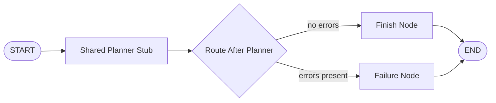
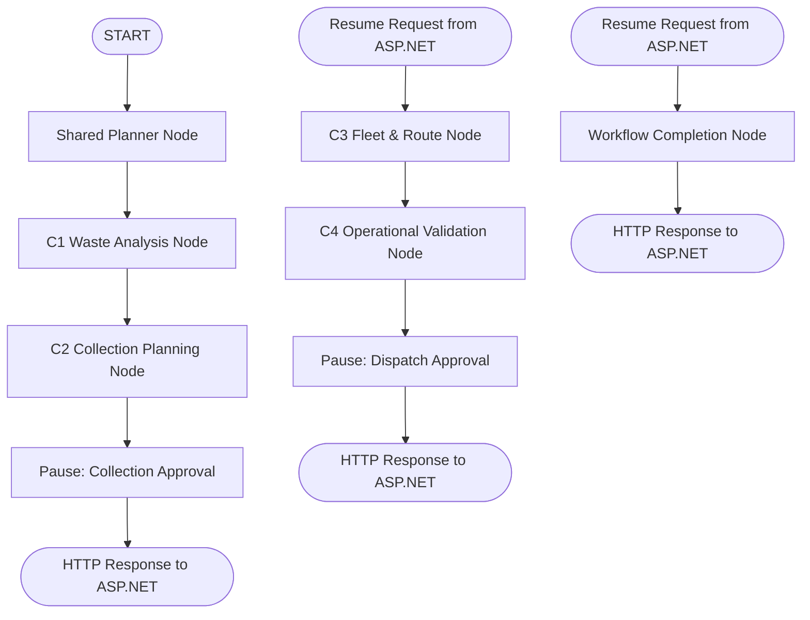
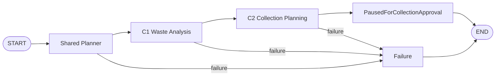
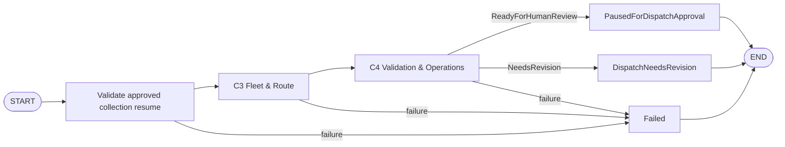

# SmartWaste LangGraph Orchestration Foundation

## 1. Architectural Boundary & Governance

The SmartWaste Agentic AI architecture maintains a strict, non-negotiable separation between operational authority and advisory intelligence:

```
┌────────────────────────────────────────────────────────┐
│             ASP.NET Core 8 Web API                     │
│  - Sole Database Connection (PostgreSQL)               │
│  - Sole Persistence of AgentWorkflow & Steps           │
│  - Identity, Authorization & Role Invariants           │
│  - Authoritative CollectionTask / Assignment Mutations │
│  - Human-in-the-Loop (HITL) Approval Gating            │
└──────────────────────────┬─────────────────────────────┘
                           │ HTTP (127.0.0.1:8000)
                           ▼
┌────────────────────────────────────────────────────────┐
│             Python FastAPI + LangGraph                 │
│  - Pure Internal Microservice (Private Network)        │
│  - Advisory Intelligence & Reasoning Only              │
│  - ZERO Direct PostgreSQL Connection                   │
│  - NO Authoritative DB Mutations                       │
│  - Stateless Per-Request Orchestration Execution       │
└────────────────────────────────────────────────────────┘
```

### Authority Principles
1. **Authoritative State vs Orchestration State**:
   - `AgentWorkflowStatus` in ASP.NET Core (`Created`, `WasteAnalysis`, `CollectionApproved`, `FleetDispatch`, `Completed`, `Failed`, etc.) is the **sole** durable lifecycle truth.
   - `OrchestrationPhase` and `GraphNodeId` in Python LangGraph are **ephemeral internal control markers** used strictly while traversing the LangGraph DAG during an active HTTP request.
2. **Prohibition of Direct Python Writes**:
   - Python never connects to PostgreSQL, never generates SQL, and never issues database mutations.
   - All operational outcomes (e.g. creating `CollectionTask`, creating `CollectionAssignment`) are executed exclusively by ASP.NET Core domain services within ACID database transactions.
3. **No Long-Lived / Hanging HTTP Connections**:
   - Human approvals (Gate 1 Collection Planning approval and Gate 2 Fleet Dispatch approval, authorized with equal rights for `MunicipalManager` and `WasteOfficer` roles in ASP.NET Core) may take minutes, hours, or days.
   - Under no circumstances does an HTTP request remain open waiting for human review.
   - When an approval boundary is reached, Python immediately pauses, packages its output into an `OrchestrationResultEnvelope` (`status="Paused"`, `approvalStage="..."`), and responds to ASP.NET Core.

---

## 2. Stateless Execution & State Reconstruction

Because Python does not maintain long-lived worker processes, in-memory background threads, or stateful Python-side databases (no Celery, no Redis, no SqliteSaver, no PostgresSaver):

1. **Durable Snapshotting**:
   - When Python returns a paused or intermediate result, ASP.NET Core persists the structured specialist outputs in PostgreSQL within `AgentWorkflowStep` / `AiWorkflowStep` records.
2. **Future Stateless Resumption**:
   - In a later step, when an authorized human reviewer (`MunicipalManager` or `WasteOfficer`) approves or requests revision through ASP.NET Core, the backend will call a Python resume entry point with the reconstructed previous state and authoritative `WorkflowResumeContext`.
   - That future Python path will rehydrate `OrchestrationState` via `create_initial_state(...)` and populated specialist slots, verify `validate_state_invariants(state)`, and resume graph execution from the appropriate node. Step 9C does not implement this endpoint or resume behavior.

---

## 3. Privacy, Auditability & Forbidden Reasoning Keys

In strict adherence to project guidelines and academic viva defenses:
- **No Hidden Chain-of-Thought (CoT)**:
  - Raw hidden thoughts, scratchpads, and unparsed reasoning tokens must never enter the shared state or be returned to ASP.NET Core.
  - The orchestrator strictly checks and rejects forbidden keys (`chain_of_thought`, `reasoning_trace`, `model_scratchpad`, `raw_prompt`, `internal_thoughts`).
- **Structured Auditability**:
  - Only structured specialist outputs (`WasteAnalysisResult`, `CollectionPlanningResult`, `FleetRouteResult`, `ValidationOperationsResult`, `SharedPlannerResult`), bounded operational errors (`OrchestrationError`), and warnings are stored and communicated.

---

## 4. Step 9A Skeleton Graph, Step 9B Shared Planner, Step 9C Collection Phase, and Future Target Graph

### Step 9B Standalone Shared Planner (Implemented)

`app.agents.shared_planner_agent.run_shared_planner` now invokes the configured
LangChain chat model to produce a structured advisory `SharedPlannerResult`.
It uses the shared model factory, parses JSON into Pydantic models, applies
trusted objective/metadata values, and runs `validate_planner_result(...)`.
Invalid model output receives at most one correction request, for a maximum of
two model invocations. The planner has no tools, database access, backend HTTP
calls, specialist execution, human-approval authority, or mutation capability.

The default `SharedPlannerPolicy.Generic` permits the smallest structurally valid
specialist subset. `SharedPlannerPolicy.EndToEndCollectionOperation` is the
flagship policy and deterministically requires the direct chain
`WasteAnalysis -> CollectionPlanning -> FleetRoute -> ValidationOperations`.
This additional policy validation does not alter the generic frozen planner
contract. `SharedPlannerResult.objective` is copied directly from the trusted
`SharedPlannerRequest.objective`; Gemini does not author or reproduce it.

This implementation remains independently callable. The Step 9A skeleton below
continues to use its deterministic stub for focused foundation tests; Step 9C
adds a separate real graph path rather than changing those test semantics.

### Step 9A Skeleton Graph (Current Implementation)
Step 9A implements the strongly typed foundation, deterministic validation, and executable skeleton without LLM or specialist calls:



#### Step 9A Skeleton Completion Semantics
In Step 9A, `OrchestrationPhase.Completed` signifies solely that the foundation graph skeleton executed deterministically to completion without errors. It does NOT mean the real end-to-end SmartWaste workflow executed (C1, C2, human collection approval, CollectionTask creation, C3, C4, human dispatch approval, and CollectionAssignment creation occur in future stages).

### Full Multi-Stage Target Graph (Future Steps)
In subsequent steps, the graph will orchestrate the complete flagship sequence across human approval boundaries:



### Step 9C Real Collection Approval Phase (Implemented)

`run_collection_approval_phase(...)` builds and runs a real LangGraph
`StateGraph` for the first half of the flagship workflow:



The graph delegates once to `run_shared_planner` using
`SharedPlannerPolicy.EndToEndCollectionOperation`, then resolves the validated
planner steps by specialist type. It passes the C1 step objective to the
canonical `WasteAnalysisRequest` and the C2 step objective to the canonical
`CollectionPlanningRequest`. C1 and C2 remain responsible for their own
authoritative tools, model calls, validation, and bounded retry behavior; the
graph itself has no model calls, tool calls, or retry loops.

The canonical planner, C1, and C2 outputs are stored in `OrchestrationState`
and returned in the typed `OrchestrationResultEnvelope`, alongside workflow ID,
objective, phase, pause stage/reason, completed specialists, warnings, errors,
and final outcome where applicable. After C2, the graph sets
`PausedForCollectionApproval` / `CollectionPlanning` and returns immediately.
This is an in-memory, serializable snapshot only: there is no Python database,
LangGraph checkpointer, Redis, global registry, approval implementation, or
resume endpoint.

ASP.NET Core will later persist the snapshot, collect an authorized human
decision from either `MunicipalManager` or `WasteOfficer`, create authoritative
`ScheduledCollectionTask` records after approval, and resume the same workflow
for C3 Fleet & Route and C4 Validation & Operations. Step 9C intentionally
does not execute C3/C4 and does not perform any business mutation.

### Step 9D Stateless Dispatch Planning Resume (Implemented)

`resume_after_collection_approval(paused_result, resume_context, ...)` is a
separate real LangGraph path for the second half of the same workflow. It
reconstructs `OrchestrationState` solely from the structured Step 9C envelope;
there is no Python checkpoint, database, Redis instance, or process-global
workflow registry.

The entry point accepts only a snapshot that is paused at
`CollectionPlanning`, retains the original workflow ID and planner/C1/C2
results, has not already run C3/C4, and has exactly the first two completed
specialists. Its `WorkflowResumeContext` must carry the same workflow ID,
`approvalStage=CollectionPlanning`, `decision=Approved`, and a non-empty
opaque `authoritativeExecutionSummary`. That summary is a precondition asserted
by ASP.NET Core after its authorized collection-plan execution bridge has
created real Scheduled CollectionTasks; Python validates its presence but does
not invent, interpret, or persist a second copy of it.



The existing Shared Planner, C1, and C2 are never re-run. C3 uses its own
authoritative tools to read current Scheduled CollectionTasks and available
fleet resources. C4 receives C3's canonical `dispatchPlans` and
`unplannedTasks` as a direct typed handoff, then uses its own fresh
authoritative validation context. Neither graph calls specialist tools or model
providers directly, and neither adds graph-level retry behavior.

`ReadyForHumanReview` becomes `PausedForDispatchApproval` with the
`FleetDispatch` approval stage. `NeedsRevision` becomes the valid, non-failure
`DispatchNeedsRevision` phase; it is not approval-ready and does not expose a
human dispatch decision. Neither outcome completes the workflow. Future ASP.NET
work will map these Python outcomes to `AwaitingDispatchApproval` and
`DispatchNeedsRevision`, respectively, then own dispatch approval and the
authoritative `CollectionAssignmentService` execution. Step 9D creates no
CollectionAssignments, RouteStops, task claims, or resource occupancy changes.

### Step 10A Internal FastAPI Transport (Implemented)

The FastAPI service exposes two machine-to-machine endpoints under
`/api/v1/internal/agent-workflows`, protected by the established
`X-Internal-Service-Key` / `INTERNAL_SERVICE_KEY` convention:

- `POST /start` accepts the ASP.NET-created `workflowId` and objective, then
  delegates only to `run_collection_approval_phase(...)`.
- `POST /resume-after-collection-approval` accepts the persisted typed Step 9C
  snapshot and `WorkflowResumeContext`, then delegates only to
  `resume_after_collection_approval(...)`.

These endpoints are transport adapters, not workflow authority. ASP.NET owns
workflow creation, persistence, human authorization, approvals, execution
bridges, and audit records; it supplies the workflow ID and persists every
returned snapshot. Python stores no workflow state, has no checkpointer or
database, exposes no approval/status/list endpoints, and creates no tasks or
assignments. React and Flutter never call these routes directly.

Successful transport calls return the existing typed
`OrchestrationResultEnvelope` using public aliases. A safe orchestration
failure encoded as a `Failed` envelope remains HTTP 200 so ASP.NET can persist
it. `DispatchNeedsRevision` is likewise a successful domain result. By contrast,
an `INVALID_RESUME_CONTEXT` envelope maps to HTTP 409, schema validation uses
FastAPI's 422 response, and a missing or invalid internal key fails closed with
HTTP 401. The opaque authoritative execution summary is passed through to the
Step 9D runner without Python interpreting it.

---

## 5. Summary of Orchestration Contracts

A Shared Planner result contains at most one step for each specialist type, matching the one-result-slot-per-specialist orchestration state.

| Component | Responsibility |
| :--- | :--- |
| `SharedPlannerResult` | Dynamic advisory execution plan proposed by Shared Planner LLM. Validated by pure deterministic topological DAG rules. Contains at most one step per specialist type. |
| `OrchestrationState` | Strongly typed TypedDict representing graph state across nodes. |
| `OrchestrationError` | Bounded, safe error model with machine-readable codes and non-sensitive details. |
| `ApprovalPauseStage` | Identifies human gating boundaries (`CollectionPlanning`, `FleetDispatch`). |
| `WorkflowResumeContext` | Authoritative context passed from ASP.NET Core when resuming a paused workflow. |
| `OrchestrationResultEnvelope` | Standardized top-level response envelope returned to ASP.NET Core. |
