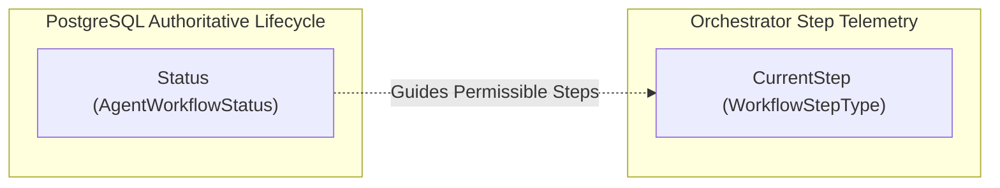

# SmartWaste Agentic AI Workflow — State Machine & Persistence Specification

> **Subsystem:** ASP.NET Core 8 Web API & PostgreSQL Persistence  
> **Namespace:** `SmartWaste.Domain.Workflow`, `SmartWaste.Application.Workflow`, `SmartWaste.Infrastructure.Workflow`  
> **Status:** FROZEN CORE ARCHITECTURE (Step 4 Stabilized)

---

## 1. Executive Summary

The SmartWaste Agentic AI Workflow orchestrates the multi-agent planning, validation, human approval, and deterministic execution pipeline across four specialized agents:

1. **C1 Waste Analysis Agent** (advisory report clustering & urgency evaluation)
2. **C2 Collection Planning Agent** (advisory candidate collection group & schedule proposals)
3. **C3 Fleet & Route Agent** (advisory dispatch plan & route proposals)
4. **C4 Validation & Operations Agent** (advisory fresh-state operational and compatibility validation & operational gatekeeping)

To guarantee academic viva defensibility, absolute auditability, and operational safety, all workflow state transitions, human approvals, specialist outputs, and execution results are authoritatively persisted in PostgreSQL via Entity Framework Core 8.

The state machine is **strictly deterministic**:
- All state changes are validated by `IAgentWorkflowStateMachine`.
- Any invalid state jump is rejected with `InvalidWorkflowTransitionException` (mapped to HTTP 409 Conflict), leaving existing state completely unchanged and creating zero spurious audit entries.
- Every state change appends an immutable record to `agent_workflow_transitions`.
- LLM outputs are stored strictly as structured JSON schemas (`InputJson`, `OutputJson`, `ValidationJson`). Raw chain-of-thought, prompt scratchpads, and hidden reasoning tokens are **strictly prohibited** from database persistence.

---

## 2. Authoritative Workflow Statuses

The workflow lifecycle is defined by exactly 15 authoritative statuses (`AgentWorkflowStatus`):

| Status | Name | Category | Description |
| :--- | :--- | :--- | :--- |
| `0` | `Created` | Initial | Workflow created by an authorized manager or officer; awaiting initiation of planning. |
| `1` | `Planning` | Active / Multi-Agent | Shared Planner / LangGraph orchestrating C1 Waste Analysis and C2 Collection Planning specialists. |
| `2` | `AwaitingCollectionApproval` | Approval Gate 1 | C2 candidate collection groups and proposed schedules submitted; waiting for authorized manager approval. |
| `3` | `CollectionNeedsRevision` | Revision Gate 1 | Authorized manager requested modifications to the collection proposal; supports re-entering `Planning` or definitive `Rejected`. |
| `4` | `CollectionApproved` | Approved Gate 1 | Authorized manager approved the candidate collection plan; ready for task creation. |
| `5` | `CreatingScheduledTasks` | Execution Bridge 1 | ASP.NET Core authoritative task service creating real `Scheduled` `CollectionTasks` in PostgreSQL. |
| `6` | `FleetPlanning` | Active / Multi-Agent | C3 Fleet & Route Agent generating multi-dispatch plans against persisted scheduled tasks. |
| `7` | `OperationalValidation` | Active / Gatekeeping | C4 Validation & Operations Agent auditing fleet plans for fresh-state operational and vehicle compatibility. |
| `8` | `AwaitingDispatchApproval` | Approval Gate 2 | C3/C4 dispatch plans and validation reports submitted; waiting for authorized manager approval. |
| `9` | `DispatchNeedsRevision` | Revision Gate 2 | Fleet dispatch proposal requires revision or replanning; supports re-entering `FleetPlanning` or definitive `Rejected`. |
| `10` | `DispatchApproved` | Approved Gate 2 | Authorized manager approved the fleet dispatch plan; ready for driver assignment execution. |
| `11` | `ExecutingAssignments` | Execution Bridge 2 | ASP.NET Core authoritative `CollectionAssignmentService` assigning tasks, vehicles, and drivers. |
| `12` | `Completed` | Terminal (Success) | The approved scope of this Agentic workflow has finished successfully and its authoritative execution results/final outcome have been recorded. Any tasks intentionally remaining unplanned or not executed are explicitly represented in the persisted workflow outcome/execution results. `CompletedAt` set. |
| `13` | `Rejected` | Terminal (Terminal Reject) | Authorized manager definitively rejected workflow at either approval gate or from either revision state. `CompletedAt` set. |
| `14` | `Failed` | Terminal (System Failure) | Unrecoverable error during agent orchestration or authoritative execution. `CompletedAt` set. |

---

## 3. Deterministic State Transition Matrix

The state machine implements exactly **26 legal transitions** (Rules A through Z). Any transition not explicitly listed in this table is illegal.

| Code | From Status | To Status | Phase / Trigger |
| :--- | :--- | :--- | :--- |
| **A** | `Created` | `Planning` | Authorized manager or officer initiates workflow planning phase. |
| **B** | `Planning` | `AwaitingCollectionApproval` | C1 and C2 finish candidate collection proposals; submitted to gate 1. |
| **C** | `Planning` | `Failed` | Specialist timeout, schema validation failure, or unrecoverable AI service error. |
| **D** | `AwaitingCollectionApproval` | `CollectionApproved` | Authorized manager approves candidate collection plan. |
| **E** | `AwaitingCollectionApproval` | `CollectionNeedsRevision` | Authorized manager requests modifications to collection plan. |
| **F** | `AwaitingCollectionApproval` | `Rejected` | Authorized manager definitively rejects workflow at collection gate. |
| **G** | `CollectionNeedsRevision` | `Planning` | Re-entering Shared Planner / C2 with human feedback and adjusted constraints. |
| **H** | `CollectionNeedsRevision` | `Rejected` | Authorized manager definitively rejects workflow from collection revision state. |
| **I** | `CollectionApproved` | `CreatingScheduledTasks` | Commencing authoritative ASP.NET task creation bridge. |
| **J** | `CollectionApproved` | `Failed` | Pre-task creation failure. |
| **K** | `CreatingScheduledTasks` | `FleetPlanning` | Real `Scheduled` `CollectionTasks` committed to PostgreSQL; invoking C3. |
| **L** | `CreatingScheduledTasks` | `Failed` | Database error, unique constraint violation, or bin concurrency conflict. |
| **M** | `FleetPlanning` | `OperationalValidation` | C3 generates multi-dispatch plans; passes to C4 for operational audit. |
| **N** | `FleetPlanning` | `Failed` | C3 specialist timeout, routing failure, or AI service crash. |
| **O** | `OperationalValidation` | `AwaitingDispatchApproval` | C4 completes operational validation; submitted to gate 2. |
| **P** | `OperationalValidation` | `DispatchNeedsRevision` | C4 validation identifies critical conflicts requiring fleet replanning. |
| **Q** | `OperationalValidation` | `Failed` | C4 validation processing error. |
| **R** | `AwaitingDispatchApproval` | `DispatchApproved` | Authorized manager approves selected dispatch plan. |
| **S** | `AwaitingDispatchApproval` | `DispatchNeedsRevision` | Authorized manager requests revision to fleet dispatch plan. |
| **T** | `AwaitingDispatchApproval` | `Rejected` | Authorized manager definitively rejects workflow at dispatch gate. |
| **U** | `DispatchNeedsRevision` | `FleetPlanning` | Re-entering C3 Fleet Planning with revised parameters. |
| **V** | `DispatchNeedsRevision` | `Rejected` | Authorized manager definitively rejects workflow from dispatch revision state. |
| **W** | `DispatchApproved` | `ExecutingAssignments` | Commencing authoritative `CollectionAssignmentService` execution bridge. |
| **X** | `DispatchApproved` | `Failed` | Pre-assignment execution failure. |
| **Y** | `ExecutingAssignments` | `Completed` | Authoritative assignment transactions committed; final outcome recorded. |
| **Z** | `ExecutingAssignments` | `Failed` | Assignment failure (e.g. driver unavailable, vehicle status conflict). |

### Failure Transition Policy
The state machine purposefully restricts `Failed` transitions to active automated execution phases:
- `Planning` -> `Failed`
- `CollectionApproved` -> `Failed`
- `CreatingScheduledTasks` -> `Failed`
- `FleetPlanning` -> `Failed`
- `OperationalValidation` -> `Failed`
- `DispatchApproved` -> `Failed`
- `ExecutingAssignments` -> `Failed`

Quiescent human review states (`Created`, `AwaitingCollectionApproval`, `CollectionNeedsRevision`, `AwaitingDispatchApproval`, `DispatchNeedsRevision`) do not fail spontaneously. They wait for authorized user action (approve, revise, or reject). This avoids arbitrary failure transitions and keeps the lifecycle transparent, auditable, and defensible.

### Revision State Semantics
Human revision states (`CollectionNeedsRevision` and `DispatchNeedsRevision`) support two distinct operational paths:
1. **Re-enter Planning:** Resumes planning with revised feedback (`CollectionNeedsRevision -> Planning` or `DispatchNeedsRevision -> FleetPlanning`).
2. **Definitive Rejection:** An authorized manager who previously requested revision may decide to definitively terminate the workflow (`CollectionNeedsRevision -> Rejected` or `DispatchNeedsRevision -> Rejected`) without being forced to re-run planning just to reject.

### Terminal States
The terminal states are:
- `Completed` (Status 12)
- `Rejected` (Status 13)
- `Failed` (Status 14)

Once a workflow reaches a terminal state, **no further transitions are permitted**. Transitioning into any terminal state automatically populates `CompletedAt` with the UTC timestamp.

### Illegal Transition Handling
Attempting an unlisted transition throws `InvalidWorkflowTransitionException`, which extends `BusinessRuleConflictException` and maps to HTTP 409 Conflict. The transaction is aborted:
- The workflow `Status` is preserved exactly as it was.
- The `Version` concurrency token is not incremented.
- No record is added to `agent_workflow_transitions`.

---

## 4. Dual-Track Model: Authoritative Status vs. Operational CurrentStep

To cleanly separate **business lifecycle governance** from **agent execution telemetry**, the system maintains two distinct fields:



### `Status` (`AgentWorkflowStatus`)
- **Authoritative:** Governs legal business operations, approval gating, and execution eligibility.
- **Enforced:** Managed strictly by `IAgentWorkflowStateMachine` and `TransitionAsync`.
- **Audited:** Every transition persists an immutable `AgentWorkflowTransition` audit log.

### `CurrentStep` (`WorkflowStepType`)
- **Operational:** Indicates which specialist or execution bridge is actively executing or was last activated:
  - `None` (0)
  - `SharedPlanning` (1)
  - `WasteAnalysis` (2)
  - `CollectionPlanning` (3)
  - `ScheduledTaskCreation` (4)
  - `FleetPlanning` (5)
  - `OperationalValidation` (6)
  - `DispatchApproval` (7)
  - `AssignmentExecution` (8)
- **Telemetry Only:** Updated via `SetCurrentStepAsync` without bypassing or altering the authoritative `Status`.
- **UI Observation:** Used by web dashboards and live monitoring widgets to display agent progress bars and active agent cards.

---

## 5. Persistence Entities & Relational Schema

All workflow tables are stored in PostgreSQL under snake_case naming conventions:

### 1. `agent_workflows` (`AgentWorkflow`)
Aggregate root managing the lifecycle.
- `id` (`uuid`, PK)
- `objective` (`varchar(1000)`, required)
- `status` (`varchar(50)`, required) — stored as string representation of enum
- `current_step` (`varchar(50)`, required) — stored as string representation of enum
- `initiated_by_user_id` (`uuid`, FK to `AspNetUsers.Id`, `ON DELETE RESTRICT`)
- `created_at` (`timestamptz`, required)
- `updated_at` (`timestamptz`, nullable)
- `completed_at` (`timestamptz`, nullable)
- `final_outcome` (`varchar(1000)`, nullable) — concise authoritative operational outcome (e.g. "2 dispatch plans executed; 2 Scheduled tasks remained unplanned")
- `version` (`integer`, required, default 1, Concurrency Token)

### 2. `agent_workflow_steps` (`AgentWorkflowStep`)
Persistent execution record for each specialist or execution bridge step.
- `id` (`uuid`, PK)
- `workflow_id` (`uuid`, FK to `agent_workflows.id`, `ON DELETE CASCADE`)
- `sequence` (`integer`, required)
- `step_type` (`varchar(50)`, required)
- `agent_name` (`varchar(100)`, nullable)
- `status` (`varchar(50)`, required) — `Pending`, `Running`, `Completed`, `Failed`, `Skipped`
- `input_json` (`jsonb`, nullable) — strongly validated structured input
- `output_json` (`jsonb`, nullable) — strongly validated structured specialist output
- `validation_json` (`jsonb`, nullable) — deterministic validation metrics / check results
- `error_message` (`varchar(2000)`, nullable)
- `started_at` (`timestamptz`, nullable)
- `completed_at` (`timestamptz`, nullable)

### 3. `agent_workflow_transitions` (`AgentWorkflowTransition`)
Append-only immutable audit trail of every state machine transition.
- `id` (`uuid`, PK)
- `workflow_id` (`uuid`, FK to `agent_workflows.id`, `ON DELETE CASCADE`)
- `from_status` (`varchar(50)`, nullable) — `null` for initial `Created` transition
- `to_status` (`varchar(50)`, required)
- `reason` (`varchar(1000)`, nullable)
- `changed_by_user_id` (`uuid`, FK to `AspNetUsers.Id`, nullable, `ON DELETE SET NULL`)
- `changed_at` (`timestamptz`, required)

### 4. `agent_workflow_approvals` (`AgentWorkflowApproval`)
Human-in-the-loop decisions recorded by authorized managers.
- `id` (`uuid`, PK)
- `workflow_id` (`uuid`, FK to `agent_workflows.id`, `ON DELETE CASCADE`)
- `workflow_step_id` (`uuid`, FK to `agent_workflow_steps.id`, nullable, `ON DELETE SET NULL`)
- `approval_stage` (`varchar(50)`, required) — `CollectionPlanning` or `FleetDispatch`
- `decision` (`varchar(50)`, required) — `Approved`, `Rejected`, or `RevisionRequested`
- `decision_reason` (`varchar(1000)`, nullable)
- `decision_payload_json` (`jsonb`, nullable) — structured human adjustments (e.g. edited schedules, re-assigned vehicles)
- `decided_by_user_id` (`uuid`, FK to `AspNetUsers.Id`, required, `ON DELETE RESTRICT`)
- `decided_at` (`timestamptz`, required)

### 5. `agent_workflow_execution_results` (`AgentWorkflowExecutionResult`)
Auditable outcomes of authoritative ASP.NET Core execution bridges.
- `id` (`uuid`, PK)
- `workflow_id` (`uuid`, FK to `agent_workflows.id`, `ON DELETE CASCADE`)
- `workflow_step_id` (`uuid`, FK to `agent_workflow_steps.id`, nullable, `ON DELETE SET NULL`)
- `execution_type` (`varchar(50)`, required) — `CollectionTaskCreation` or `CollectionAssignment`
- `status` (`varchar(50)`, required) — `Pending`, `Succeeded`, `Failed`, `PartiallySucceeded`
- `result_json` (`jsonb`, nullable) — structured identifiers of created tasks or assignments
- `error_message` (`varchar(2000)`, nullable)
- `executed_at` (`timestamptz`, required)

---

## 6. Strict Guard Rails: No Hidden Reasoning / Chain-of-Thought

In compliance with **AGENTS.md Section 9 (AI Service & Agentic Governance)** and privacy/security standards:
- Internal reasoning scratchpads, raw LLM chain-of-thought tokens, and unfiltered prompt completions are **never stored** in the database.
- Entities only accept strongly structured contract payloads conforming to frozen specialist contracts (`C1`, `C2`, `C3`, `C4`).
- Reflection and unit test verification (`StructuredJsonStorage_PersistsValidJson_WithoutHiddenReasoning`) explicitly assert the absence of `ChainOfThought`, `ReasoningTrace`, or `HiddenScratchpad` properties across all workflow entities.

---

## 7. Optimistic Concurrency Control

To prevent race conditions when multiple users or background orchestrators interact with a workflow:
- The `AgentWorkflow` entity incorporates an integer `Version` property configured with `.IsConcurrencyToken()`.
- On every transition, `Version` is incremented.
- `RecordApprovalAsync` also increments `Version` and updates `UpdatedAt` in the same save operation, guaranteeing that concurrent modifications raise a `DbUpdateConcurrencyException`.
- In the future workflow API, human approval actions will atomically record the approval and execute the corresponding workflow status transition (`AwaitingCollectionApproval -> CollectionApproved / CollectionNeedsRevision / Rejected` or `AwaitingDispatchApproval -> DispatchApproved / DispatchNeedsRevision / Rejected`) within a single concurrency-validated transaction.

---

## 8. Service Registration & Integration Architecture

The workflow subsystem is registered in `SmartWaste.Infrastructure/DependencyInjection.cs`:

```csharp
// Workflow State Machine (Deterministic & Stateless)
services.AddSingleton<IAgentWorkflowStateMachine, AgentWorkflowStateMachine>();

// Workflow Persistence & Orchestration Service (Scoped with DbContext)
services.AddScoped<IAgentWorkflowService, AgentWorkflowService>();
```

### Future Integration Points (Step 5+)
1. **Shared Planner Orchestrator (LangGraph / Python API):** Invokes C1 -> C2 -> C3 -> C4 in coordinated sequence, calling ASP.NET Core state transition endpoints.
2. **Workflow API (`/api/v1/agent-workflows`):** Exposes initiation, status inspection, and history endpoints to the React web application.
3. **HITL Approval Endpoints:** Dedicated endpoints for authorized managers to submit `CollectionPlanning` and `FleetDispatch` decisions with mandatory reasons.
4. **Execution Bridges:** Transactional service calls to create `Scheduled` `CollectionTasks` and invoke `CollectionAssignmentService` directly within ASP.NET Core without AI service privilege escalation.

---

## 9. Dispatch Approval and Authoritative Assignment Execution

`AwaitingDispatchApproval` is a human-review boundary. Only an authenticated
`MunicipalManager` or `WasteOfficer` can approve, request revision, reject, or
execute an approved dispatch proposal. Approval is bound to the exact completed
`OperationalValidation` (C4) step through `AgentWorkflowApproval.WorkflowStepId`.
The persisted C4 output must be `ReadyForHumanReview`; when it declares
`requiresAcknowledgement`, the human must explicitly acknowledge warnings.

The approved execution source is the canonical `FleetPlanning.OutputJson` C3
proposal that C4 received in its `InputJson`. ASP.NET verifies that invariant
before execution when a persisted C3 step is available, then performs fresh
authoritative checks for task eligibility and claims, driver and vehicle
availability/occupancy, and fleet-waste compatibility. It uses the existing
`CollectionAssignmentService` transaction to create one `CollectionAssignment`
per C3 dispatch plan with the suggested stop order preserved. C3 `unplannedTasks`
remain scheduled and unassigned.

No Python or Gemini call occurs after dispatch approval. Successful backend
assignment creation transitions `DispatchApproved -> ExecutingAssignments ->
Completed`; this records completion of the approved planning/execution setup,
not physical driver route completion. Driver lifecycle actions remain separate.
Revision transitions to `DispatchNeedsRevision`; rejection transitions to
`Rejected`. If authoritative execution fails, its business transaction rolls
back and a durable `Failed` workflow/execution audit is persisted.

---

## 10. Recovery After Committed Collection Task Creation

The general state machine treats `Failed` as terminal. There is one narrowly
guarded service-level recovery for a transport or AI-service failure while
resuming C3/C4 *after* the approved C2 plan has already created and committed
`Scheduled` `CollectionTasks`. A fresh call to the existing
`execute-collection-plan` action, with the current workflow version, may resume
the Python continuation only when the persisted failure transition identifies
that exact post-commit phase, the completed C2 approval and successful task
creation execution are still bound together, every recorded task ID still
exists in `Scheduled` state, and no C3/C4 output or dispatch action exists.

The recovery records an audited `Failed -> FleetPlanning` transition and
increments the workflow version. It reuses the committed task IDs and stored
execution summary; it does not rerun C1/C2 or create tasks again. An unrelated
failure, stale version, changed task, or partial downstream result remains
ineligible for this recovery path. This exception does not change the generic
state machine's terminal-state policy.

The workflow-detail read projection may include `binCodes`, keyed by full bin
UUIDs found in the persisted C2 need references. The values come from the
authoritative `WasteBins.BinCode` records and are display-only; C2 `OutputJson`
and every canonical `needId` remain unchanged. Missing historical bin metadata
is tolerated by the presentation layer.
