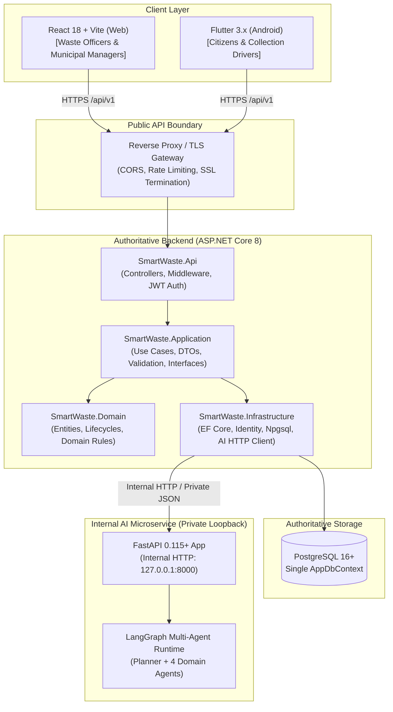
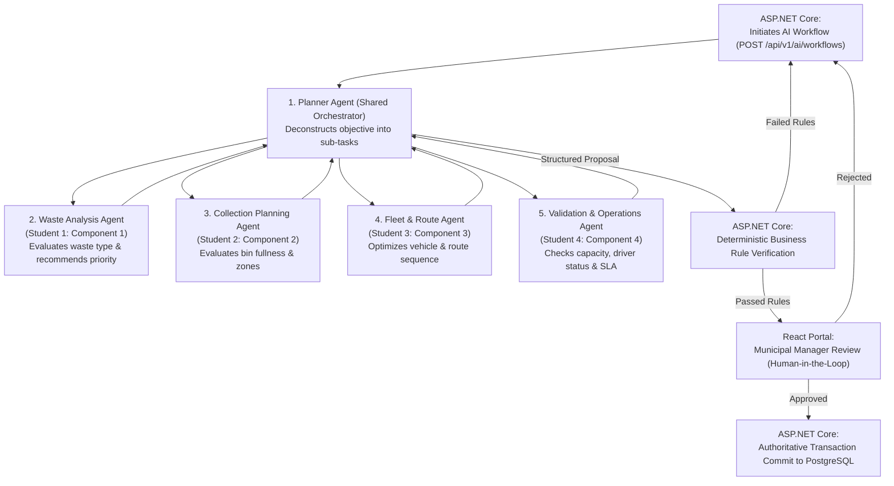
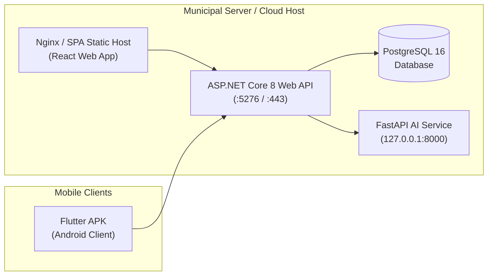

# SmartWaste — System Architecture Specification

> **Status:** FROZEN SOURCE OF TRUTH  
> **System Name:** SmartWaste — AI-Assisted Waste Collection & Management System  
> **Architecture Pattern:** ASP.NET Core Modular Monolith with an Internal Python AI Service  
> **Authoritative Backend:** ASP.NET Core 8 Web API  
> **Primary Database:** PostgreSQL 16+ (Accessed exclusively via EF Core in ASP.NET Core)  
> **AI Orchestration:** Python 3.12, FastAPI, LangGraph

---

## 1. Executive Summary & Architectural Pattern

SmartWaste is an enterprise-grade university software engineering project designed to modernize municipal solid waste collection, citizen reporting, route planning, and fleet logistics through collaborative multi-agent artificial intelligence.

The architectural pattern is strictly an **ASP.NET Core Modular Monolith paired with an Internal Python AI Service**. It is explicitly **NOT** a distributed microservices architecture:
- All core business logic, domain boundaries, data persistence, and role-based authorizations reside centrally in the **ASP.NET Core 8 Web API**.
- The **Python FastAPI service** operates purely as an internal, stateless computational and agentic reasoning coprocessor invoked over private HTTP by ASP.NET Core.
- The **PostgreSQL database** is private to ASP.NET Core. The Python AI service has **no direct database connection** and cannot perform unauthorized database writes.
- Web (React) and Mobile (Flutter) client applications communicate **exclusively** with ASP.NET Core. Under no circumstances do client applications communicate directly with the Python AI service.

---

## 2. End-to-End System Topography



---

## 3. Core Business Components & Primary Users

The application is decomposed into four cohesive business components, each matched to specific primary actors and client platforms:

| Component | Scope & Mission | Primary Actor | Primary Client |
| :--- | :--- | :--- | :--- |
| **1. Waste Reporting & Citizen Management** | Citizen waste issue reporting, photo uploads, officer field verification, and citizen engagement. | **Citizen** (Public)<br>**WasteOfficer** (Field) | **Flutter** (Citizen)<br>**React** (Officer) |
| **2. Waste Collection & Bin Management** | Public roadside bin registry, accepted waste streams, manual observation tracking (discrete 0–100% fill levels & physical condition), derived collection needs queue (Sources A, B, C), and atomic collection task scheduling. | **WasteOfficer** (Management)<br>**Citizen** (Discovery) | **React** (Officer)<br>**Flutter** (Citizen) |
| **3. Fleet, Driver & Route Management** | Collection vehicle inventory, driver duty tracking, vehicle/driver dispatch assignment, route optimization, and waypoint execution. | **Driver**<br>**WasteOfficer** | **Flutter** (Driver)<br>**React** (Officer) |
| **4. Operations, Complaints & Analytics** | Citizen grievances, operational field incidents, notifications, multi-agent AI approval workflows, and executive analytics. | **MunicipalManager**<br>**Citizen** | **React** (Manager)<br>**Flutter** (Citizen) |

---

## 4. User Roles & Access Control

Access control is enforced through ASP.NET Core Identity with role-based authorization attributes (`[Authorize(Roles = AppRoles.X)]`):

```csharp
public static class AppRoles
{
    public const string Citizen = "Citizen";
    public const string WasteOfficer = "WasteOfficer";
    public const string Driver = "Driver";
    public const string MunicipalManager = "MunicipalManager";
}
```

### Role Capabilities
1. **`Citizen`**:
   - Registers publicly via `/api/v1/auth/register` (strictly restricted to `Citizen` role).
   - Submits and tracks own `WasteReport` records.
   - Discovers nearby public roadside bins, inspects accepted waste streams and public availability, and requests external directions.
   - Files and monitors own `Complaint` records.
   - Cannot verify reports, register or modify bins, record bin observations, dispatch/reschedule tasks, view other citizens' records, or approve AI workflows.
2. **`WasteOfficer`**:
   - Verifies or rejects citizen waste reports.
   - Manages municipal roadside bin registry (registration, operational metadata updates, deactivation).
   - Records manual field bin observations (fill levels and physical condition).
   - Reviews the unified municipal collection needs queue (Sources A, B, and C with active task suppression).
   - Dispatches single-location collection tasks manually and reschedules unstarted collection tasks.
   - Initiates AI planning workflows.
3. **`Driver`**:
   - Manages personal duty availability (`Available`, `OffDuty`).
   - Receives and accepts `CollectionAssignment` dispatches in the mobile app.
   - Executes navigational route stops, updating statuses (`Arrived`, `Completed`, `Skipped`).
   - Reports `OperationalIncident` events (breakdown, access blockage).
4. **`MunicipalManager`**:
   - Senior administrative supervisor.
   - Reviews and adjudicates escalated complaints and operational incidents.
   - Reviews AI workflow recommendations and holds sole authority to execute `AiApproval` (`Approved`, `Rejected`, `RevisionRequested`).
   - Accesses high-level aggregated operational analytics.

---

## 5. Backend Solution Architecture (`/backend`)

The backend follows the principles of Clean Architecture / Onion Architecture organized across four distinct projects:

```
backend/
├── SmartWaste.sln
├── src/
│   ├── SmartWaste.Api/               # Presentation & Boundary Layer
│   ├── SmartWaste.Application/       # Orchestration & Use Case Layer
│   ├── SmartWaste.Domain/            # Core Domain & Entity Layer
│   └── SmartWaste.Infrastructure/    # Persistence & External Service Layer
└── tests/
    └── SmartWaste.Tests/             # Unit & Integration Test Suite
```

### 5.1 Project Responsibilities

#### `SmartWaste.Domain`
- **Dependencies:** None (Pure .NET standard/net8.0).
- **Contents:**
  - Entities (`AppUser`, `WasteReport`, `WasteBin`, `CollectionTask`, `Vehicle`, `Complaint`, `AiWorkflow`, etc.).
  - Enums and static constants (`AppRoles`, status lifecycles).
  - Domain exceptions and core domain invariants.

#### `SmartWaste.Application`
- **Dependencies:** `SmartWaste.Domain`, `FluentValidation`.
- **Contents:**
  - Use-case services and business workflows (e.g., `ReportVerificationService`, `AssignmentService`).
  - DTOs (`RegisterRequest`, `AuthResponse`, `WasteReportDto`, `AiHealthDto`).
  - Service interfaces (`IAuthService`, `IAiServiceClient`, `ITokenService`).
  - Request validators (`RegisterRequestValidator`, `LoginRequestValidator`).
  - Configuration option models (`JwtOptions`, `AiServiceOptions`).
- **Rule:** Uses standard service interfaces and dependency injection; avoids unnecessary CQRS/MediatR complexity.

#### `SmartWaste.Infrastructure`
- **Dependencies:** `SmartWaste.Application`, `SmartWaste.Domain`, EF Core, Npgsql, ASP.NET Core Identity.
- **Contents:**
  - `AppDbContext`: Main EF Core DbContext extending `IdentityDbContext<AppUser, IdentityRole<Guid>, Guid>`.
  - Fluent API configurations (`IEntityTypeConfiguration<T>`).
  - ASP.NET Core Identity store bindings.
  - Implementations of application interfaces (`TokenService`, `AuthService`).
  - Typed `HttpClient` implementations (`AiServiceClient`) with resilience, timeouts, and error mapping.

#### `SmartWaste.Api`
- **Dependencies:** `SmartWaste.Application`, `SmartWaste.Infrastructure`, ASP.NET Core Web API.
- **Contents:**
  - RESTful API Controllers (`AuthController`, `WasteReportsController`, `DevAiController`).
  - Pipeline Middleware: `ExceptionHandlingMiddleware` (maps exceptions to RFC 7807 `ProblemDetails`).
  - Authentication/Authorization configuration (JWT Bearer tokens).
  - Swagger/OpenAPI documentation setup.

### 5.2 Request Execution Flow
```
HTTP Request ──> Controller ──> Application Service ──> Infrastructure/EF Core ──> PostgreSQL
                      │
                      └──> Exception? ──> ExceptionHandlingMiddleware ──> ProblemDetails (503/400/404)
```

---

## 6. Client Architecture & Integration

Both client applications are built to serve specific user roles while sharing identical authentication, error conventions, and authoritative business rules.

### 6.1 React Web Application (`/web`)
- **Technology:** React 18, Vite, TypeScript, Tailwind CSS, Axios, React Router, Zustand / React Context.
- **Target Audience:** `WasteOfficer` and `MunicipalManager`.
- **Key Modules:**
  - Authentication & Role Guarding (`ProtectedRoute`, `RoleRoute`).
  - Verification Dashboard: Review citizen waste reports with photo attachments.
  - Bin & Schedule Manager: Interactive zone management and schedule generator.
  - Fleet & Dispatch Console: Driver assignments and live vehicle operational states.
  - AI Review Portal: Human-in-the-loop review interface displaying structured AI recommendations, route metrics, and approval/rejection actions.
- **Security:** JWT stored securely in memory / local session storage with automatic Bearer token injection via Axios interceptors.

### 6.2 Flutter Mobile Application (`/mobile`)
- **Technology:** Flutter 3.x, Dart, Dio HTTP client, Flutter Secure Storage, Riverpod.
- **Target Audience:** `Citizen` and `Driver`.
- **Key Modules:**
  - Citizen Mode:
    - GPS-tagged photo report submission.
    - Personal report status tracking with timeline history.
    - Service complaint filing.
  - Driver Mode:
    - Shift availability toggle (`Available` / `OffDuty`).
    - Assigned task list and route waypoint navigator.
    - Stop status updater (`Arrived`, `Completed`, `Skipped`).
    - One-tap operational incident logger.
- **Security:** Access tokens stored strictly in hardware-backed `FlutterSecureStorage`. Base URL dynamically configurable (`10.0.2.2:5276` for Android Emulator, LAN IP for physical device via `--dart-define=API_BASE_URL=...`).

---

## 7. Python AI Service Architecture (`/ai-service`)

The Python AI service is an internal, stateless microservice dedicated to Agentic AI workflow orchestration.

### 7.1 Directory Layout
```
ai-service/
├── app/
│   ├── agents/          # Autonomous agent implementations
│   ├── api/             # Internal routers (/health, internal workflow endpoints)
│   ├── core/            # Configuration (pydantic-settings), structured logging
│   ├── graphs/          # LangGraph state graph definitions and workflows
│   ├── models/          # Pydantic schemas for state, inputs, outputs
│   ├── services/        # Service-layer business helpers
│   ├── tools/           # Allow-listed tools callable by agents
│   └── main.py          # FastAPI entrypoint and lifespan manager
├── tests/               # Pytest suite
├── requirements.txt     # Locked production dependencies
└── requirements-dev.txt # Development and testing dependencies
```

### 7.2 Current AI Foundation Status
- **Python Version:** 3.12.
- **Framework:** FastAPI with Uvicorn server running on `127.0.0.1:8000`.
- **Graph Orchestration:** `langgraph` installed and importable.
- **Operational Endpoints:** `GET /health` responding with `{"status":"healthy","service":"SmartWaste AI Service"}`.
- **LLM Provider Decision (Step 9A.14a):**
  - **Authoritative Provider:** Google Gemini API via `langchain-google-genai` (`ChatGoogleGenerativeAI`).
  - **Configuration (Environment Variables):**
    - `LLM_PROVIDER`: `"mock"` (default for offline automated tests) or `"google"` (for live development/demo).
    - `LLM_MODEL`: Model identifier (e.g. `gemini-1.5-flash`).
    - `LLM_API_KEY`: Runtime secret key (never committed; loaded from gitignored `.env` or runtime environment).
    - `LLM_TEMPERATURE`: Default `0.0` for deterministic structured output.
    - `LLM_TIMEOUT`: Default `30.0` seconds.
  - **Offline Testing:** Automated pytest suites use `LLM_PROVIDER="mock"` with zero live network calls and no live API keys.
  - **ADR Notice:** This selection represents the project's authoritative model provider decision and will be formalized in the final Agentic AI ADR.

---

## 8. Multi-Agent Agentic AI Architecture

The agentic architecture divides responsibilities among five distinct agents using **LangGraph**:



### 8.1 Student Agent Ownership & Specialization
To ensure distinct individual academic contributions while maintaining architectural coherence, ownership is distributed as follows:

1. **Planner Agent (Shared Orchestration)**:
   - Maintains global workflow state in LangGraph.
   - Deconstructs municipal objectives into sequenced agent tasks.
   - Aggregates agent findings into a cohesive proposal.
2. **Waste Analysis Agent (Student 1 — Component 1)**:
   - **Responsibility:** Analyses already-verified WasteReports and produces a structured, non-authoritative operational assessment for downstream collection planning.
   - **Allowed Tools:** Strictly allow-listed `get_verified_waste_reports` tool (retrieving authoritative `Verified` reports via ASP.NET Core internal authenticated endpoint). Zero direct PostgreSQL or Supabase access.
   - **Input Contract (`WasteAnalysisRequest`):** `objective` (string, 5-500 chars), `page` (int >= 1), `page_size` (int 1-50).
   - **Structured Output Contract (`WasteAnalysisResult` / `WasteReportAnalysis`):** `reportId`, `categoryAssessment`, `recommendedPriority` (`Low`, `Medium`, `High`, `Urgent`), `operationalConcerns` (0-5 items), `recommendedHandling`, `confidence` (`Low`, `Medium`, `High`), `rationale`.
   - **Advisory Recommendation Semantics:** `recommendedPriority` is purely advisory for downstream planning; it NEVER mutates authoritative `WasteReport.Priority` or `WasteReport.Status` in the database.
   - **Safety Boundaries:**
     - *No Image Analysis:* `attachmentCount` indicates file presence only. Agent never inspects photos or claims visual evidence.
     - *Location Boundary:* GPS coordinates and address are raw reported data; agent never invents road names, traffic, distance, or route facts.
     - *Prompt-Injection Resistance:* Report fields are untrusted citizen data; instructions embedded in descriptions are strictly ignored.
     - *Exact Coverage Rule:* Produces exactly one analysis per verified report returned by the tool.
   - **Planner Delegation:** Shared Planner Agent will delegate objectives to this specialized agent in multi-agent workflows.
3. **Collection Planning Agent (Student 2 — Component 2)**:
   - **Responsibility:** Evaluates municipal collection needs (derived from Verified waste reports, full/overflowing roadside bins, and routine collection schedules) and proposes non-authoritative collection route/batch candidates.
   - **Allowed Tools:** Strictly allow-listed `get_collection_needs` tool (retrieving candidate needs via ASP.NET Core internal authenticated endpoint `GET /api/v1/internal/ai-tools/collection-needs`). Zero direct PostgreSQL access.
   - **Advisory Recommendation Semantics:** Proposes candidate task groups and collection priority sequences for downstream fleet allocation and routing; never authoritatively creates `CollectionTask` records or updates database statuses directly.
   - **Safety Boundaries:** Respects active task suppression, administrative bin availability, and deterministic weekday schedules.
   - **Planner Delegation:** Shared Planner Agent will delegate collection needs evaluation to this specialized agent in multi-agent workflows.
4. **Fleet & Route Agent (Student 3 — Component 3)**:
   - Evaluates available vehicles matching required capacity and waste type.
   - Performs route planning/optimization for waypoints to minimize travel time.
5. **Validation & Operations Agent (Student 4 — Component 4)**:
   - Pre-evaluates operational feasibility against historical SLA metrics.
   - Validates that proposal adheres to municipal collection guidelines.

---

## 9. AI Governance, Safety & Deterministic Rules

The integration of generative and agentic AI is bounded by strict software engineering controls:

### 9.1 Core AI Directives
1. **AI Proposes; ASP.NET Validates and Commits**:
   - The AI service has zero write access to the PostgreSQL database.
   - All AI outputs are structured recommendations (`jsonb`) returned to ASP.NET Core.
2. **Deterministic Rules Override AI Suggestions**:
   - Every proposal undergoes strict programmatic validation in ASP.NET Core before reaching a human manager.
   - If any deterministic rule fails, the proposal is rejected or returned for revision:
     - `WasteReport.Status` must be `Verified` before scheduling (`WasteReport` transitions atomically from `Verified` to `Scheduled`; C1 audit trail appended using existing `ChangedByUserId` and `Notes` properties).
     - `WasteBin.AdministrativeStatus` must be `Active`.
     - Single-target XOR constraint: each `CollectionTask` targets strictly EITHER a `WasteReport` OR a `WasteBin`.
     - Reason consistency: Report tasks require `VerifiedReport` reason; `OfficerDiscretion` is permitted strictly for `WasteBin` targets and mandates a non-empty `SchedulingReason` (distinct from optional operational `HandlingNotes`).
     - No duplicate active `CollectionTask` for the same target (enforced via partial unique indexes on active statuses `Scheduled`, `Assigned`, `InProgress`).
     - Selected `Driver` must be in `Available` status.
     - Selected `Vehicle` must be in `Available` status.
     - No overlapping active `CollectionAssignment` for the selected driver or vehicle.
     - Total estimated load must not exceed vehicle load capacity.
     - Terminal task immutability: `Completed`, `Cancelled`, and `Failed` are terminal historical records. `Failed` tasks never revert or resolve linked reports and cannot be mutated to `Cancelled`.
     - Replacement boundaries: Report-task reopening and replacement following failure or cancellation is a reserved future C3/C1 integration decision (no reverse status transitions exist). Bin-targeted replacement following failure requires explicit WasteOfficer review (unresolved future operation). No operational report-task cancellation endpoint is exposed in C2.
3. **Human-in-the-Loop (HITL) for High-Impact Actions**:
   - High-impact AI recommendations (automated batch collection dispatch, vehicle route generation) require explicit `MunicipalManager` approval in the React web app (`POST /api/v1/ai/workflows/{id}/decision`) before database commit.
   - Deterministic manual operational scheduling: `WasteOfficer` can create single-target collection tasks directly (`POST /api/v1/collection-tasks/manual`) and reschedule unstarted tasks (`POST /api/v1/collection-tasks/{id}/reschedule`) without AI workflow involvement.
4. **Transparent, Auditable Workflow History**:
   - All workflow steps (`AiWorkflowStep`) and tool calls (`AiToolCall`) are persistently logged with inputs and outputs in PostgreSQL.
   - **No Hidden Chain-of-Thought Storage**: Internal reasoning traces or raw thoughts are never stored in the database. Only auditable, structured actions, parameters, summaries, and outcomes are persisted.
5. **Strict Allow-Listed Tools**:
   - Agents invoke only pre-registered, strongly typed tools with validated JSON schemas.

---

## 10. Future Integrations (Third-Party Services)

Future development phases will incorporate external services under strict encapsulation:
- **Routing & Maps**: Turn-by-turn routing, distance matrices, and polyline generation will be integrated in ASP.NET Core / Python AI service. Third-party API keys (e.g., Google Maps, Mapbox, or OSRM) will remain private on the backend and never exposed to React or Flutter clients.
- **Object Storage**: Photographic attachments (`ReportAttachment`) will be persisted using secure cloud storage (e.g., S3/Blob) or managed municipal storage with pre-signed upload URLs.
- **Push Notifications**: Firebase Cloud Messaging (FCM) or Apple APNs will be integrated into ASP.NET Core for mobile alert dispatch.

---

## 11. Security & Compliance Architecture

- **Authentication**: Stateless HMAC-SHA256 JWT access tokens issued by ASP.NET Core with strict expiration and cryptographic validation.
- **Client Platform Role Policy**:
  - **React Web Application**: Strictly restricted to municipal staff (`WasteOfficer` and `MunicipalManager`).
  - **Flutter Mobile Application**: Strictly restricted to public citizens and field collectors (`Citizen` and `Driver`).
  - **Platform Enforcement**: Validated on `POST /api/v1/auth/login` via `clientType`. Incompatible role attempts return `403 Forbidden` (`ProblemDetails`) without issuing a JWT. Both web and mobile frontends also perform defense-in-depth role checks.
- **Internal User Provisioning & Password Lifecycle**:
  - **Citizen Registration**: Only `Citizen` accounts can be created via public registration (`POST /api/v1/auth/register`).
  - **Staff User Provisioning**: Internal accounts (`Driver`, `WasteOfficer`, `MunicipalManager`) are created exclusively by authorized `MunicipalManager` users (`POST /api/v1/users`).
  - **One-Time Temporary Passwords**: Provisioned users receive a cryptographically secure 16-character temporary password returned strictly once upon creation (never stored in plaintext, never logged, never returned in list/detail queries).
  - **Mandatory First-Login Password Change**: Accounts created with temporary passwords have `MustChangePassword = true`. The issued JWT includes `must_change_password = "True"`. Backend middleware strictly restricts access to `POST /api/v1/auth/change-password` and `GET /api/v1/auth/me`; attempts to access business endpoints return `403 Forbidden` (`ProblemDetails`). Both client applications immediately force navigation to a dedicated Change Password screen.
  - **Account Deactivation Guard**: Municipal Managers can toggle staff active status (`isActive`), but cannot deactivate their own active account.
- **Authorization**: Role-based access control (`Citizen`, `WasteOfficer`, `Driver`, `MunicipalManager`) enforced on every endpoint.
- **Secrets Management**: Configuration via ASP.NET Core User Secrets (Development) and Environment Variables (Production). No plain-text credentials, database passwords, or JWT signing keys are committed to Git.
- **Cross-Origin Resource Sharing (CORS)**: Controlled strictly by ASP.NET Core in `Program.cs`, permitting only authorized client origins.
- **Audit Logging**: Immutable ledger (`AuditLog`) capturing user actions, administrative decisions, and AI approvals.

---

## 12. Deployment Architecture Concept

The entire SmartWaste platform is designed for containerized or modular deployment:



- **Database**: Single PostgreSQL container/instance.
- **Authoritative Backend**: ASP.NET Core 8 Linux/Windows container.
- **AI Service**: Python 3.12 container bound to internal private networking.
- **Web Client**: Production build of React SPA served via Nginx or ASP.NET static file middleware.
- **Mobile Client**: Standalone Android APK installed on citizen and driver devices, communicating securely over HTTPS.
