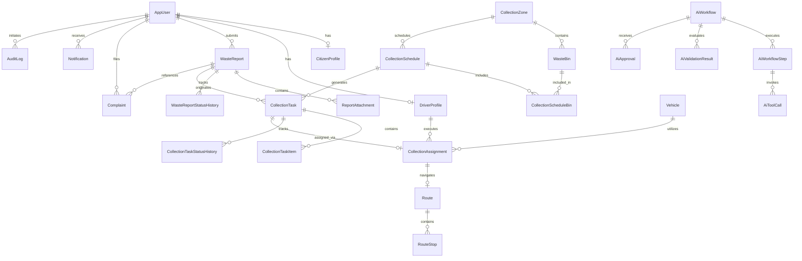

# SmartWaste — Database Schema Specification

> **Status:** FROZEN SOURCE OF TRUTH  
> **Target Database:** PostgreSQL 16+ via Entity Framework Core (Npgsql)  
> **Key Strategy:** GUID primary keys (`uuid`), UTC timestamps (`timestamptz`), strict foreign keys, deterministic business state lifecycles.

This document establishes the authoritative conceptual data model for the Smart Waste Management System. All entity designs, relations, enums, and indexes detailed here must be preserved during implementation. Final EF Core Fluent API configurations (`EntityTypeBuilder<T>`) will serve as the technical implementation authority, adhering strictly to this specification.

---

## 1. Architectural Conventions & Data Types

| Concept | Implementation Standard | PostgreSQL Type | Notes |
| :--- | :--- | :--- | :--- |
| **Primary Keys** | `Guid` (`System.Guid`) | `uuid` | Generated via `Guid.NewGuid()` / `gen_random_uuid()` unless defined by ASP.NET Core Identity. |
| **Foreign Keys** | `Guid` (`System.Guid`) | `uuid` | Enforces referential integrity with cascading rules documented per relationship. |
| **Timestamps** | `DateTime` (`System.DateTime`) | `timestamptz` | All timestamps **MUST** be stored in UTC (`DateTime.UtcNow`). |
| **Coordinates** | `double` / `decimal(9,6)` | `numeric(9,6)` / `double precision` | Latitude (-90.0 to 90.0) and Longitude (-180.0 to 180.0). |
| **Status / Enums** | C# Enum stored as `string` | `varchar(50)` | Stored as strings for clarity, readability, and migration stability. |
| **Text Payloads** | `string` | `varchar(n)` / `text` | Constrained `varchar` for codes/titles, `text` for descriptions and notes. |
| **Structured Payloads**| `string` / JSON | `jsonb` | Used for tool inputs/outputs and structured audit metadata. |

---

## 2. Identity and Shared Entities

### 2.1 `AppUser`
Extends `IdentityUser<Guid>`. Core user entity managed by ASP.NET Core Identity.

*Already implemented in `SmartWaste.Domain.Entities.AppUser`.*

| Field | Type | Nullable | Description |
| :--- | :--- | :--- | :--- |
| `Id` | `Guid` | No | PK inherited from `IdentityUser<Guid>` (`uuid`). |
| `UserName` | `string` | No | Inherited from Identity (matches Email normalized). |
| `Email` | `string` | No | Inherited from Identity. |
| `PhoneNumber` | `string` | Yes | Inherited from Identity. |
| `PasswordHash` | `string` | Yes | Inherited from Identity (hashed with PBKDF2). |
| `FullName` | `string` | No | User's display name (`varchar(150)`). |
| `IsActive` | `bool` | No | Account status flag (default: `true`). |
| `MustChangePassword` | `bool` | No | Mandatory first-login password change flag (default: `false`, set to `true` for manager-provisioned internal accounts). |
| `CreatedAt` | `DateTime` | No | UTC registration timestamp. |
| `UpdatedAt` | `DateTime` | Yes | UTC timestamp of last modification. |

#### Roles
Roles are managed via ASP.NET Core Identity roles (`IdentityRole<Guid>`):
- `Citizen`: General public user submitting reports and complaints (assigned by default on public registration).
- `WasteOfficer`: Field supervisor managing bins, verifying reports, and planning schedules.
- `Driver`: Municipal collection vehicle operator executing assigned collection tasks.
- `MunicipalManager`: Executive overseeing operations, resolving escalated complaints, and approving AI workflow recommendations.

---

### 2.2 `CitizenProfile`
One-to-one extension for users holding the `Citizen` role. *(Deferred — not required for Component 1 core waste reporting; `WasteReport.CitizenId` references `AppUser.Id` directly).*

| Field | Type | Nullable | Description |
| :--- | :--- | :--- | :--- |
| `UserId` | `Guid` | No | PK & FK to `AppUser.Id` (Cascade delete). |
| `Address` | `string` | Yes | Default residential or business address (`varchar(255)`). |
| `DefaultLatitude` | `double` | Yes | Preferred home/work latitude. |
| `DefaultLongitude` | `double` | Yes | Preferred home/work longitude. |
| `CreatedAt` | `DateTime` | No | UTC timestamp of profile creation. |
| `UpdatedAt` | `DateTime` | Yes | UTC timestamp of last modification. |

---

### 2.3 `DriverProfile`
One-to-one extension for users holding the `Driver` role.

| Field | Type | Nullable | Description |
| :--- | :--- | :--- | :--- |
| `UserId` | `Guid` | No | PK & FK to `AppUser.Id` (Cascade delete). |
| `LicenseNumber` | `string` | No | Heavy/commercial vehicle driver license number (`varchar(50)`). **Unique**. |
| `AvailabilityStatus`| `string` | No | Availability state (`varchar(30)`). Default: `Available`. |
| `CreatedAt` | `DateTime` | No | UTC timestamp of profile creation. |
| `UpdatedAt` | `DateTime` | Yes | UTC timestamp of last modification. |

#### Driver Availability Status Lifecycle
- `Available`: Driver is on duty and eligible for a collection assignment.
- `Assigned`: Driver has an active task/assignment in progress.
- `OffDuty`: Driver is off work, on leave, or inactive.

---

## 3. Component 1 — Waste Reporting & Citizen Management

### 3.1 `WasteReport`
Represents an illegal dumping or overflow report submitted by a citizen.

| Field | Type | Nullable | Description |
| :--- | :--- | :--- | :--- |
| `Id` | `Guid` | No | Primary Key (`uuid`). |
| `CitizenId` | `Guid` | No | FK to `AppUser.Id` (Reporter). Server-derived from authenticated JWT; no dependency on deferred `CitizenProfile`. Citizen must never supply arbitrary `CitizenId`. |
| `Description` | `string` | No | Detailed description of the waste site (`text`, 10–1000 characters). |
| `WasteType` | `string` | No | Categorization of reported waste (`varchar(50)`). |
| `Latitude` | `double` | No | Geospatial latitude of the report location (-90.0 to 90.0). |
| `Longitude` | `double` | No | Geospatial longitude of the report location (-180.0 to 180.0). |
| `AddressText` | `string` | Yes | Human-readable address or landmark description (`varchar(500)`). |
| `Status` | `string` | No | Current lifecycle status (`varchar(50)`). Default: `Submitted`. |
| `Priority` | `WasteReportPriority?` | Yes | Operational priority enum (`varchar(30)`: `Low`, `Medium`, `High`, `Urgent`). Nullable (`WasteReportPriority?`). Priority remains null during Component 1 verification. It may later be assigned only through authoritative ASP.NET business logic after operational/AI-assisted planning. AI may recommend but never persist it directly. |
| `VerifiedByUserId` | `Guid` | Yes | FK to `AppUser.Id` (WasteOfficer who verified the report). Set exclusively by backend during verification; null for other statuses. |
| `VerifiedAt` | `DateTime` | Yes | UTC timestamp when verified by WasteOfficer. Set exclusively by backend during verification. |
| `CreatedAt` | `DateTime` | No | UTC timestamp of submission. |
| `UpdatedAt` | `DateTime` | Yes | UTC timestamp of last update. |

#### Waste Types
- `General`: Mixed solid municipal waste.
- `Organic`: Food scraps, yard waste, biodegradable material.
- `Recyclable`: Paper, cardboard, plastics, glass, metals.
- `Hazardous`: Chemicals, batteries, e-waste, biological hazards.
- `Bulky`: Furniture, appliances, construction debris.
- `Other`: Uncategorized waste requiring field inspection.

#### Waste Report Priority Enum (`WasteReportPriority`)
`WasteReport.Priority` is formalized as a nullable domain enum `WasteReportPriority?`:
- `Low`
- `Medium`
- `High`
- `Urgent`

Persisted in PostgreSQL as `varchar(30)`. `WasteReport.Priority` remains `null` during Component 1 verification. It may later be assigned only through authoritative ASP.NET Core business logic after operational/AI-assisted planning. The AI service may recommend a priority, but has zero direct database connection and never persists it directly.

#### Waste Report Status Lifecycle & Transitions
```
Submitted ──> UnderReview ──> Verified ──> Scheduled ──> InProgress ──> Resolved
     │             │
     │             └──> Rejected
     │
     └──> Cancelled (by Citizen while Submitted)
```

##### Allowed Status Transitions
| From Status | To Status | Trigger / Action | Authorized Role | Preconditions & Business Rules |
| :--- | :--- | :--- | :--- | :--- |
| *(None)* | `Submitted` | `POST /api/v1/waste-reports` | `Citizen` | Valid payload; `CitizenId` set from JWT; initial status history created atomically. |
| `Submitted` | `UnderReview` | `POST /api/v1/waste-reports/{id}/start-review` | `WasteOfficer` | Report in `Submitted`; locks citizen editing/cancellation; history logged. Viewing does not start review. |
| `Submitted` | `Cancelled` | `DELETE /api/v1/waste-reports/{id}` | `Citizen` (Owner) | Report in `Submitted`; business cancellation (no hard delete); no citizen-supplied cancellation reason required (`Notes` is null or backend default "Cancelled by citizen"). |
| `UnderReview` | `Verified` | `POST /api/v1/waste-reports/{id}/verify` | `WasteOfficer` | Report in `UnderReview`; sets `Status = Verified`, `VerifiedByUserId`, `VerifiedAt`, `UpdatedAt`; history logged. Verification does NOT assign Priority (`WasteReportPriority?` remains null). Report becomes eligible for later AI planning. |
| `UnderReview` | `Rejected` | `POST /api/v1/waste-reports/{id}/reject` | `WasteOfficer` | Report in `UnderReview`; required `reason` (5–500 chars) stored in `WasteReportStatusHistory.Notes`. |
| `Verified` | `Scheduled` | Approved collection plan / authoritative `CollectionTask` creation | *Component 2 Operational Workflow (ASP.NET Core)* | Linked to planned `CollectionTask`. AI may recommend scheduling in later phases, but AI has zero direct write access to PostgreSQL; authoritative transition and task creation are executed solely via ASP.NET Core. |
| `Scheduled` | `InProgress` | Authoritative start of collection work associated with the report/task | *Component 3 Operational Workflow (ASP.NET Core)* | Triggered by the authoritative start of collection work associated with the report/task. Route, RouteStop, and WasteReport state transitions are kept conceptually separate. |
| `InProgress` | `Resolved` | Collection Completion | *Component 3 / Driver* | Waste collected and site cleared. |

> [!IMPORTANT]
> **No Hard Deletes:** `WasteReport` records are never physically removed from PostgreSQL. Citizen cancellation via `DELETE /api/v1/waste-reports/{id}` executes a business state transition to `Cancelled`, preserving full auditability, status history, and foreign key integrity.
>
> **Status Lifecycle Ownership:**
> - **Component 1:** Owns `Submitted`, `UnderReview`, `Verified`, `Rejected`, and `Cancelled`.
> - **Future Component 2:** Owns `Verified` → `Scheduled` (executed authoritatively via ASP.NET Core upon approved collection plan / `CollectionTask` creation).
> - **Future Component 3:** Owns `Scheduled` → `InProgress` (Trigger: Authoritative start of collection work associated with the report/task. Owner: Component 3 operational workflow through ASP.NET Core. Route, RouteStop, and WasteReport state transitions are kept conceptually separate) and `InProgress` → `Resolved` (collection completion and site clearance).
>
> **AI Eligibility Boundary & Roadmap:**
> - Only reports in `Verified` status are eligible inputs for automated AI collection planning. Reports in `Submitted`, `UnderReview`, `Rejected`, `Cancelled`, `Scheduled`, `InProgress`, or `Resolved` are strictly ineligible.
> - **AI Roadmap:** After deterministic Component 1 is implemented and verified, Step 9A.13 will expose an AI-safe Component 1 capability (`get_verified_waste_reports`), and Step 9A.14 will establish the Waste Analysis Agent foundation. Full Planner / LangGraph multi-agent orchestration remains deferred until subsequent components and tools exist.
> - **No Direct AI Writes:** The Python AI microservice has zero direct database connection and zero write access to PostgreSQL. AI is purely advisory; all state transitions and entity creations are executed authoritatively by ASP.NET Core.
>
> **No Generic Status PATCH:** Status transitions cannot be executed via generic PATCH or direct field updates. Every state transition is executed through its specific, authorized business operation endpoint and recorded in `WasteReportStatusHistory`.

---

### 3.2 `ReportAttachment`
Photographic evidence attached to a waste report.

| Field | Type | Nullable | Description |
| :--- | :--- | :--- | :--- |
| `Id` | `Guid` | No | Primary Key (`uuid`). |
| `WasteReportId` | `Guid` | No | FK to `WasteReport.Id` (Cascade delete). |
| `StorageKey` | `string` | No | Provider-independent object storage key/identifier (e.g., `waste-reports/{reportId}/{uniqueId}.ext`) (`varchar(500)`). Persisted key returned by configured cloud storage; domain does not store public URLs or image binaries in PostgreSQL. |
| `FileType` | `string` | No | MIME type (`image/jpeg`, `image/png`, `image/webp`) (`varchar(100)`). |
| `CreatedAt` | `DateTime` | No | UTC timestamp of upload. |

#### Cloud Storage Architecture & Attachment Constraints
- **Cloud/Object Storage Strategy:** Photographic attachments are persisted in a free cloud object storage service (exact provider to be selected in Step 9A.7; kept provider-independent so domain entities remain decoupled from AWS S3, Supabase, Cloudinary, Firebase, or Azure Blob).
- **Storage Abstraction:** Implementation will utilize an `IFileStorageService` abstraction (`UploadAsync`, `DeleteAsync`, `GetReadUrlAsync`).
- **Secure Image Access:** `fileUrl` is strictly an API response/display concern (e.g., short-lived signed read URL or authorized backend URL generated by `IFileStorageService`). Clients never depend on raw `StorageKey` or hold secret cloud credentials. Knowing a `StorageKey` does not grant access; viewing attachments is authorization-controlled.
- **Relationship:** 1 `WasteReport` → 0..3 `ReportAttachment` records (maximum 3 images per report).
- **Format Restrictions:** JPEG (`image/jpeg`), PNG (`image/png`), WebP (`image/webp`).
- **File Size Limit:** Maximum 5 MB per file.
- **Lifecycle Guard:** Attachments can only be uploaded (`POST /api/v1/waste-reports/{id}/attachments`) or removed (`DELETE /api/v1/waste-reports/{id}/attachments/{attachmentId}`) by the owner Citizen while the report is in `Submitted` status. Once `UnderReview` or later, attachments are permanently locked from modification.
- **Visibility:** Read-only for `WasteOfficer` and `MunicipalManager`.

---

### 3.3 `WasteReportStatusHistory`
Audit record tracking every state change for accountability, timeline visualization, and SLA tracking.

| Field | Type | Nullable | Description |
| :--- | :--- | :--- | :--- |
| `Id` | `Guid` | No | Primary Key (`uuid`). |
| `WasteReportId` | `Guid` | No | FK to `WasteReport.Id` (Cascade delete). |
| `FromStatus` | `string` | Yes | Previous status (`null` for initial `Submitted` creation). |
| `ToStatus` | `string` | No | New status (`varchar(50)`). |
| `ChangedByUserId`| `Guid` | Yes | FK to `AppUser.Id` who performed the transition (`null` for automated system events). |
| `Notes` | `string` | Yes | Rejection reason (required on reject, 5–500 chars), officer remarks (optional on start-review), or cancellation notes (optional/backend default, e.g. "Cancelled by citizen") (`text`). |
| `ChangedAt` | `DateTime` | No | UTC timestamp of change. |

#### Audit Behavior & Transaction Rules
- **Initial Submission:** Creation of a `WasteReport` atomically inserts an initial history record (`FromStatus = null`, `ToStatus = Submitted`, `ChangedByUserId = CitizenId`, `ChangedAt = CreatedAt`).
- **Atomic State Transitions:** All subsequent status transitions (`UnderReview`, `Verified`, `Rejected`, `Cancelled`, `Scheduled`, `InProgress`, `Resolved`) must insert a history record atomically in the same database transaction as the report update.
- **Rejection vs Cancellation Notes:**
  - When a report is rejected by a `WasteOfficer`, the mandatory rejection reason (5–500 characters) is persisted in `WasteReportStatusHistory.Notes`. No separate `RejectionReason` column exists on `WasteReport`.
  - When a report is cancelled by a `Citizen`, no cancellation reason is required; `Notes` is persisted as `null` or a backend default `"Cancelled by citizen"`.

---

## 4. Component 2 — Waste Collection & Bin Management

### 4.1 `CollectionZone`
Geographical division for municipal waste operations.

| Field | Type | Nullable | Description |
| :--- | :--- | :--- | :--- |
| `Id` | `Guid` | No | Primary Key (`uuid`). |
| `Name` | `string` | No | Zone name/identifier, e.g., "Zone 1 - Colombo North" (`varchar(100)`). |
| `Description` | `string` | Yes | Boundary or regional details (`text`). |
| `IsActive` | `bool` | No | Operational status flag (default: `true`). |
| `CreatedAt` | `DateTime` | No | UTC creation timestamp. |
| `UpdatedAt` | `DateTime` | Yes | UTC timestamp of last update. |

---

### 4.2 `WasteBin`
Physical public waste bin or smart bin station.

| Field | Type | Nullable | Description |
| :--- | :--- | :--- | :--- |
| `Id` | `Guid` | No | Primary Key (`uuid`). |
| `CollectionZoneId`| `Guid` | No | FK to `CollectionZone.Id` (Restrict delete). |
| `BinCode` | `string` | No | Unique municipal asset code, e.g., `BIN-ZN1-0042` (`varchar(50)`). **Unique**. |
| `Latitude` | `double` | No | Geospatial latitude. |
| `Longitude` | `double` | No | Geospatial longitude. |
| `Capacity` | `double` | No | Total volume capacity in liters (e.g., 240.0, 1100.0). |
| `CurrentFillLevel`| `double` | Yes | Estimated percentage (0.0% to 100.0%). |
| `Status` | `string` | No | Operational status (`varchar(50)`). Default: `Active`. |
| `LastCollectedAt` | `DateTime` | Yes | UTC timestamp of most recent pickup. |
| `CreatedAt` | `DateTime` | No | UTC creation timestamp. |
| `UpdatedAt` | `DateTime` | Yes | UTC timestamp of last update. |

#### Bin Status Values
- `Active`: Normal operational bin in service.
- `Full`: Bin fill level exceeds collection threshold (e.g., $\ge 80\%$) requiring dispatch.
- `Maintenance`: Bin damaged, vandalized, or undergoing repairs.
- `Inactive`: Decommissioned or removed from the street.

---

### 4.3 `CollectionSchedule`
Planned recurring or calendar-based collection routine for a zone.

| Field | Type | Nullable | Description |
| :--- | :--- | :--- | :--- |
| `Id` | `Guid` | No | Primary Key (`uuid`). |
| `CollectionZoneId`| `Guid` | No | FK to `CollectionZone.Id` (Restrict delete). |
| `Name` | `string` | No | Schedule title, e.g., "Tuesday Zone 1 Organic Collection" (`varchar(150)`). |
| `ScheduledDate` | `DateTime` | No | Planned execution date/time (UTC). |
| `Status` | `string` | No | Schedule status (`varchar(50)`). Default: `Draft`. |
| `CreatedByUserId` | `Guid` | No | FK to `AppUser.Id` (WasteOfficer). |
| `CreatedAt` | `DateTime` | No | UTC creation timestamp. |
| `UpdatedAt` | `DateTime` | Yes | UTC timestamp of last update. |

#### Schedule Status Values
- `Draft`: Being assembled by officer.
- `Planned`: Finalized and queued for task generation.
- `Active`: Associated collection tasks are currently active.
- `Completed`: All associated tasks finished.
- `Cancelled`: Schedule called off.

---

### 4.4 `CollectionScheduleBin`
Join entity linking waste bins included in a specific collection schedule.

| Field | Type | Nullable | Description |
| :--- | :--- | :--- | :--- |
| `CollectionScheduleId` | `Guid` | No | PK & FK to `CollectionSchedule.Id` (Cascade delete). |
| `WasteBinId` | `Guid` | No | PK & FK to `WasteBin.Id` (Restrict delete). |
| `Sequence` | `int` | Yes | Planned pickup sequence index along the route. |

*Composite Primary Key / Unique Constraint:* `(CollectionScheduleId, WasteBinId)`.

---

### 4.5 `CollectionTask`
Authoritative unit of work dispatched for collection. May originate from a verified ad-hoc `WasteReport` OR a scheduled zone routine `CollectionSchedule`.

| Field | Type | Nullable | Description |
| :--- | :--- | :--- | :--- |
| `Id` | `Guid` | No | Primary Key (`uuid`). |
| `WasteReportId` | `Guid` | Yes | FK to `WasteReport.Id` (Set null on report delete). |
| `CollectionScheduleId` | `Guid` | Yes | FK to `CollectionSchedule.Id` (Set null on schedule delete). |
| `Status` | `string` | No | Lifecycle status (`varchar(50)`). Default: `Pending`. |
| `Priority` | `string` | No | Task priority (`Low`, `Medium`, `High`, `Urgent`). |
| `ScheduledFor` | `DateTime` | Yes | Planned pickup window target (UTC). |
| `CreatedAt` | `DateTime` | No | UTC creation timestamp. |
| `UpdatedAt` | `DateTime` | Yes | UTC timestamp of last update. |

#### Task Status Values
- `Pending`: Created, awaiting driver and vehicle assignment.
- `Assigned`: Assigned to driver/vehicle, awaiting execution.
- `InProgress`: Driver has started pickup route.
- `Completed`: All items collected and task finished.
- `Cancelled`: Task abandoned or re-planned.

---

### 4.6 `CollectionTaskItem`
Individual waypoint or stop item comprising a collection task.

| Field | Type | Nullable | Description |
| :--- | :--- | :--- | :--- |
| `Id` | `Guid` | No | Primary Key (`uuid`). |
| `CollectionTaskId`| `Guid` | No | FK to `CollectionTask.Id` (Cascade delete). |
| `WasteBinId` | `Guid` | Yes | FK to `WasteBin.Id` (if stop is a scheduled bin). |
| `WasteReportId` | `Guid` | Yes | FK to `WasteReport.Id` (if stop is an ad-hoc report). |
| `Sequence` | `int` | No | Ordering index of this item in the task. |
| `CompletedAt` | `DateTime` | Yes | UTC timestamp when driver completed this item. |
| `Notes` | `string` | Yes | Driver collection notes (`text`). |

*Constraint:* Exactly one of `WasteBinId` or `WasteReportId` must be non-null for each item.

---

### 4.7 `CollectionTaskStatusHistory`
Audit trail for task state changes.

| Field | Type | Nullable | Description |
| :--- | :--- | :--- | :--- |
| `Id` | `Guid` | No | Primary Key (`uuid`). |
| `CollectionTaskId`| `Guid` | No | FK to `CollectionTask.Id` (Cascade delete). |
| `FromStatus` | `string` | Yes | Previous status (`null` for creation). |
| `ToStatus` | `string` | No | New status (`varchar(50)`). |
| `ChangedByUserId`| `Guid` | Yes | FK to `AppUser.Id` (Officer, Driver, or System). |
| `Notes` | `string` | Yes | Remarks on status transition. |
| `ChangedAt` | `DateTime` | No | UTC timestamp of change. |

---

## 5. Component 3 — Fleet, Driver & Route Management

### 5.1 `Vehicle`
Municipal collection truck or compactor vehicle.

| Field | Type | Nullable | Description |
| :--- | :--- | :--- | :--- |
| `Id` | `Guid` | No | Primary Key (`uuid`). |
| `RegistrationNumber` | `string` | No | License plate / registration code (`varchar(50)`). **Unique**. |
| `VehicleType` | `string` | No | Type (`Compactor`, `Flatbed`, `Tipper`, `SmallVan`) (`varchar(50)`). |
| `Capacity` | `double` | No | Maximum load capacity in kilograms or cubic meters. |
| `Status` | `string` | No | Operational readiness (`varchar(50)`). Default: `Available`. |
| `CreatedAt` | `DateTime` | No | UTC creation timestamp. |
| `UpdatedAt` | `DateTime` | Yes | UTC timestamp of last update. |

#### Vehicle Status Values
- `Available`: Ready for operational assignment.
- `Assigned`: Currently assigned to an active route.
- `Maintenance`: Under repair or scheduled service.
- `Inactive`: Out of fleet service permanently.

---

### 5.2 `CollectionAssignment`
Binds a `CollectionTask`, a qualified `Driver`, and a suitable `Vehicle`.

| Field | Type | Nullable | Description |
| :--- | :--- | :--- | :--- |
| `Id` | `Guid` | No | Primary Key (`uuid`). |
| `CollectionTaskId`| `Guid` | No | FK to `CollectionTask.Id` (Restrict delete). |
| `DriverId` | `Guid` | No | FK to `AppUser.Id` (holding `DriverProfile`). |
| `VehicleId` | `Guid` | No | FK to `Vehicle.Id` (Restrict delete). |
| `AssignedByUserId`| `Guid` | No | FK to `AppUser.Id` (WasteOfficer or MunicipalManager). |
| `AssignedAt` | `DateTime` | No | UTC timestamp when assigned. |
| `Status` | `string` | No | Assignment state (`varchar(50)`). Default: `Assigned`. |
| `CompletedAt` | `DateTime` | Yes | UTC timestamp when completed. |

#### Assignment Status Values
- `Assigned`: Dispatched to driver, visible in mobile app.
- `Accepted`: Driver accepted duty in mobile app.
- `InProgress`: Driver started navigation/collection.
- `Completed`: Collection completed and verified.
- `Cancelled`: Assignment aborted or reassigned.

#### Deterministic Assignment Constraints
- A driver cannot have more than one assignment in status `Assigned`, `Accepted`, or `InProgress` concurrently.
- A vehicle cannot have more than one assignment in status `Assigned`, `Accepted`, or `InProgress` concurrently.

---

### 5.3 `Route`
Optimized navigational path calculated for a `CollectionAssignment`.

| Field | Type | Nullable | Description |
| :--- | :--- | :--- | :--- |
| `Id` | `Guid` | No | Primary Key (`uuid`). |
| `CollectionAssignmentId` | `Guid` | No | FK to `CollectionAssignment.Id` (Cascade delete). |
| `ExternalRouteReference` | `string` | Yes | Reference ID from routing engine/polyline data (`text`). |
| `EstimatedDistance` | `double` | No | Total estimated path length in meters. |
| `EstimatedDuration` | `double` | No | Total estimated travel time in seconds. |
| `Status` | `string` | No | Route execution status (`varchar(50)`). Default: `Planned`. |
| `CreatedAt` | `DateTime` | No | UTC creation timestamp. |
| `UpdatedAt` | `DateTime` | Yes | UTC timestamp of last update. |

#### Route Status Values
- `Planned`: Computed, ready for execution.
- `Active`: Driver currently navigating the route.
- `Completed`: Driver completed all waypoints.
- `Cancelled`: Route discontinued or superseded.

---

### 5.4 `RouteStop`
Ordered waypoint visited along the route.

| Field | Type | Nullable | Description |
| :--- | :--- | :--- | :--- |
| `Id` | `Guid` | No | Primary Key (`uuid`). |
| `RouteId` | `Guid` | No | FK to `Route.Id` (Cascade delete). |
| `Sequence` | `int` | No | 1-based order of stop execution. |
| `WasteBinId` | `Guid` | Yes | FK to `WasteBin.Id` (if bin waypoint). |
| `WasteReportId` | `Guid` | Yes | FK to `WasteReport.Id` (if report waypoint). |
| `Latitude` | `double` | No | Stop coordinate latitude. |
| `Longitude` | `double` | No | Stop coordinate longitude. |
| `Status` | `string` | No | Stop status (`varchar(50)`). Default: `Pending`. |
| `ArrivedAt` | `DateTime` | Yes | UTC timestamp when driver reached stop. |
| `CompletedAt` | `DateTime` | Yes | UTC timestamp when stop clearance finished. |

#### Stop Status Values
- `Pending`: Awaiting visit.
- `Arrived`: Driver arrived at waypoint.
- `Completed`: Waste collected at stop.
- `Skipped`: Stop skipped due to obstruction or access issue.

*Uniqueness Constraint:* `(RouteId, Sequence)` must be unique.

---

## 6. Component 4 — Operations, Complaints & Analytics

### 6.1 `Complaint`
Represents a citizen grievance regarding service quality (missed pickup, spilled waste, driver misconduct). **Distinct from a `WasteReport`**.

| Field | Type | Nullable | Description |
| :--- | :--- | :--- | :--- |
| `Id` | `Guid` | No | Primary Key (`uuid`). |
| `CitizenId` | `Guid` | No | FK to `AppUser.Id` (Complainant). |
| `WasteReportId` | `Guid` | Yes | Optional FK to `WasteReport.Id` if complaint relates to a specific report. |
| `Subject` | `string` | No | Complaint title (`varchar(200)`). |
| `Description` | `string` | No | Full grievance description (`text`). |
| `Status` | `string` | No | Lifecycle status (`varchar(50)`). Default: `Open`. |
| `AssignedOfficerId`| `Guid` | Yes | FK to `AppUser.Id` (Investigating WasteOfficer / Manager). |
| `ResolutionNotes` | `string` | Yes | Official resolution explanation provided to citizen (`text`). |
| `CreatedAt` | `DateTime` | No | UTC submission timestamp. |
| `UpdatedAt` | `DateTime` | Yes | UTC update timestamp. |
| `ResolvedAt` | `DateTime` | Yes | UTC resolution timestamp. |

#### Complaint Status Values
- `Open`: Newly filed by citizen.
- `UnderReview`: Officer actively investigating.
- `InProgress`: Corrective action dispatched.
- `Resolved`: Addressed and closed with explanatory notes.
- `Rejected`: Deemed invalid or unsubstantiated.

---

### 6.2 `OperationalIncident`
Field problem reported by drivers, officers, or dispatchers during collection (e.g., road blockage, vehicle breakdown, bin damage).

| Field | Type | Nullable | Description |
| :--- | :--- | :--- | :--- |
| `Id` | `Guid` | No | Primary Key (`uuid`). |
| `CollectionAssignmentId` | `Guid` | Yes | Optional FK to `CollectionAssignment.Id`. |
| `ReportedByUserId` | `Guid` | No | FK to `AppUser.Id` (Reporter). |
| `Type` | `string` | No | Incident category (`Breakdown`, `Blockage`, `Accident`, `Damage`) (`varchar(50)`). |
| `Description` | `string` | No | Incident details (`text`). |
| `Severity` | `string` | No | Severity level (`Low`, `Medium`, `High`, `Critical`). |
| `Status` | `string` | No | Incident state (`Open`, `Investigating`, `Resolved`) (`varchar(50)`). |
| `CreatedAt` | `DateTime` | No | UTC incident logging timestamp. |
| `ResolvedAt` | `DateTime` | Yes | UTC resolution timestamp. |

---

### 6.3 `Notification`
In-app and push notification record for all platform users.

| Field | Type | Nullable | Description |
| :--- | :--- | :--- | :--- |
| `Id` | `Guid` | No | Primary Key (`uuid`). |
| `UserId` | `Guid` | No | FK to `AppUser.Id` (Recipient). |
| `Title` | `string` | No | Notification header (`varchar(200)`). |
| `Message` | `string` | No | Notification content (`text`). |
| `Type` | `string` | No | Notification category (`ReportUpdate`, `TaskAssigned`, `IncidentAlert`, `System`) (`varchar(50)`). |
| `IsRead` | `bool` | No | Read receipt flag (default: `false`). |
| `CreatedAt` | `DateTime` | No | UTC creation timestamp. |
| `ReadAt` | `DateTime` | Yes | UTC read timestamp. |

---

### 6.4 `AuditLog`
Immutable compliance and security ledger recording all high-impact actions.

| Field | Type | Nullable | Description |
| :--- | :--- | :--- | :--- |
| `Id` | `Guid` | No | Primary Key (`uuid`). |
| `UserId` | `Guid` | Yes | FK to `AppUser.Id` (Actor, or `null` for system events). |
| `Action` | `string` | No | Verb describing action (`UserLogin`, `VerifyReport`, `ApproveAiPlan`, `AssignTask`) (`varchar(100)`). |
| `EntityType` | `string` | No | Target entity class (`WasteReport`, `AiWorkflow`, `CollectionTask`) (`varchar(100)`). |
| `EntityId` | `Guid` | Yes | Primary key of the affected entity. |
| `Details` | `string` | Yes | Structured contextual metadata stored as `jsonb`. |
| `CreatedAt` | `DateTime` | No | UTC occurrence timestamp. |

> **Analytics Note:** There is **NO** separate generic `Analytics` table. Operational analytics (collection efficiency, bin fullness trends, SLA adherence, complaints by zone) are computed as read-only projections/aggregations directly from operational tables (`WasteReport`, `CollectionTask`, `Route`, `Complaint`).

---

## 7. Agentic AI Workflow Entities

These entities record persistent, auditable executions of the internal LangGraph AI service. No unverified, untracked, or non-deterministic actions are executed against the core database.

### 7.1 `AiWorkflow`
Represents an end-to-end multi-agent AI planning and optimization run.

| Field | Type | Nullable | Description |
| :--- | :--- | :--- | :--- |
| `Id` | `Guid` | No | Primary Key (`uuid`). |
| `Objective` | `string` | No | Goal description, e.g., "Optimize Zone 1 Tuesday Route after overflow" (`text`). |
| `WorkflowType` | `string` | No | Workflow categorization (`RouteOptimization`, `ReportTriage`, `DispatchPlanning`) (`varchar(50)`). |
| `Status` | `string` | No | Workflow lifecycle status (`varchar(50)`). Default: `Created`. |
| `InitiatedByUserId` | `Guid` | No | FK to `AppUser.Id` (Officer or Manager who initiated). |
| `RelatedEntityType` | `string` | No | Linked entity type (`WasteReport`, `CollectionSchedule`, `CollectionZone`) (`varchar(50)`). |
| `RelatedEntityId` | `Guid` | No | PK of the linked operational entity. |
| `StartedAt` | `DateTime` | No | UTC execution start timestamp. |
| `CompletedAt` | `DateTime` | Yes | UTC execution conclusion timestamp. |
| `FinalOutcome` | `string` | Yes | High-level execution summary (`text`). |

#### AI Workflow Status Lifecycle
```
Created ──> Planning ──> Running ──> ValidationFailed (terminates or retries)
                           │
                           └──> AwaitingApproval ──> Approved ──> Completed
                                       │
                                       └──> Rejected / Failed
```
- `Created`: Initial entry recorded before sending to AI service.
- `Planning`: Planner Agent synthesizing requirements and sub-goals.
- `Running`: Specialized agents executing allow-listed tools.
- `ValidationFailed`: Deterministic validation rules failed; AI recommendation rejected prior to manager review.
- `AwaitingApproval`: Plan passed all deterministic rules; queued for Municipal Manager human-in-the-loop review.
- `Approved`: Municipal Manager approved the proposal.
- `Rejected`: Municipal Manager rejected the recommendation.
- `Completed`: Authoritative database transaction committed by ASP.NET Core.
- `Failed`: Service, timeout, or runtime failure during execution.

---

### 7.2 `AiWorkflowStep`
Individual step executed by an autonomous agent during workflow progression.

| Field | Type | Nullable | Description |
| :--- | :--- | :--- | :--- |
| `Id` | `Guid` | No | Primary Key (`uuid`). |
| `AiWorkflowId` | `Guid` | No | FK to `AiWorkflow.Id` (Cascade delete). |
| `StepNumber` | `int` | No | Sequential step index. |
| `AgentName` | `string` | No | Identifier of agent (`PlannerAgent`, `WasteAnalysisAgent`, `FleetRouteAgent`) (`varchar(100)`). |
| `Action` | `string` | No | Description of action performed (`varchar(255)`). |
| `Status` | `string` | No | Step status (`InProgress`, `Completed`, `Failed`) (`varchar(50)`). |
| `ResultSummary` | `string` | Yes | Auditable human-readable summary of step output (`text`). |
| `StartedAt` | `DateTime` | Yes | UTC step start timestamp. |
| `CompletedAt` | `DateTime` | Yes | UTC step finish timestamp. |
| `ErrorMessage` | `string` | Yes | Error details if step failed (`text`). |

> **Audit Policy:** Hidden LLM chain-of-thought tokens **MUST NEVER** be stored in the database. Only structured, auditable inputs, summaries, and outputs are recorded.

---

### 7.3 `AiToolCall`
Granular audit record of each tool executed by an agent.

| Field | Type | Nullable | Description |
| :--- | :--- | :--- | :--- |
| `Id` | `Guid` | No | Primary Key (`uuid`). |
| `AiWorkflowStepId`| `Guid` | No | FK to `AiWorkflowStep.Id` (Cascade delete). |
| `ToolName` | `string` | No | Registered allow-listed tool name (`GetBinMetrics`, `EstimateVehicleRoute`) (`varchar(100)`). |
| `InputJson` | `string` | No | Structured parameters sent to tool (`jsonb`). |
| `OutputJson` | `string` | Yes | Structured response returned from tool (`jsonb`). |
| `Status` | `string` | No | Tool execution status (`Success`, `Failure`) (`varchar(50)`). |
| `StartedAt` | `DateTime` | No | UTC tool call start timestamp. |
| `CompletedAt` | `DateTime` | Yes | UTC tool call end timestamp. |
| `ErrorMessage` | `string` | Yes | Diagnostic error message if tool failed. |

---

### 7.4 `AiValidationResult`
Deterministic validation rule evaluation against the AI-generated proposal before human approval.

| Field | Type | Nullable | Description |
| :--- | :--- | :--- | :--- |
| `Id` | `Guid` | No | Primary Key (`uuid`). |
| `AiWorkflowId` | `Guid` | No | FK to `AiWorkflow.Id` (Cascade delete). |
| `RuleName` | `string` | No | Deterministic rule evaluated (`DriverAvailabilityCheck`, `VehicleCapacityCheck`) (`varchar(100)`). |
| `IsValid` | `bool` | No | Validation outcome. |
| `Message` | `string` | No | Explanation of validation result (`varchar(500)`). |
| `CreatedAt` | `DateTime` | No | UTC validation timestamp. |

---

### 7.5 `AiApproval`
Human-in-the-loop decision record made by a `MunicipalManager`.

| Field | Type | Nullable | Description |
| :--- | :--- | :--- | :--- |
| `Id` | `Guid` | No | Primary Key (`uuid`). |
| `AiWorkflowId` | `Guid` | No | FK to `AiWorkflow.Id` (Cascade delete). |
| `ManagerUserId` | `Guid` | No | FK to `AppUser.Id` (Must hold `MunicipalManager` role). |
| `Decision` | `string` | No | Review decision (`varchar(50)`). |
| `Comments` | `string` | Yes | Manager's rationale or modification notes (`text`). |
| `DecidedAt` | `DateTime` | No | UTC decision timestamp. |

#### Decision Values
- `Approved`: Plan authorized for authoritative transaction execution in ASP.NET Core.
- `Rejected`: Plan discarded without changes to operational tables.
- `RevisionRequested`: Plan returned to AI service with feedback for replanning.

---

## 8. Indexing Strategy and Uniqueness Constraints

To guarantee sub-second queries across high-frequency lookups and guarantee referential integrity, the following indexes and constraints must be configured in EF Core Fluent API:

```csharp
// Uniqueness Constraints
builder.Entity<DriverProfile>().HasIndex(d => d.LicenseNumber).IsUnique();
builder.Entity<WasteBin>().HasIndex(b => b.BinCode).IsUnique();
builder.Entity<Vehicle>().HasIndex(v => v.RegistrationNumber).IsUnique();
builder.Entity<CollectionScheduleBin>().HasKey(sb => new { sb.CollectionScheduleId, sb.WasteBinId });
builder.Entity<RouteStop>().HasIndex(rs => new { rs.RouteId, rs.Sequence }).IsUnique();

// Operational Query Indexes
builder.Entity<WasteReport>().HasIndex(r => r.Status);
builder.Entity<WasteReport>().HasIndex(r => r.CitizenId);
builder.Entity<WasteReport>().HasIndex(r => r.CreatedAt);
builder.Entity<WasteReport>().HasIndex(r => new { r.Status, r.WasteType });

builder.Entity<WasteBin>().HasIndex(b => b.CollectionZoneId);
builder.Entity<WasteBin>().HasIndex(b => b.Status);

builder.Entity<CollectionTask>().HasIndex(t => t.Status);
builder.Entity<CollectionTask>().HasIndex(t => t.ScheduledFor);

builder.Entity<CollectionAssignment>().HasIndex(a => new { a.DriverId, a.Status });
builder.Entity<CollectionAssignment>().HasIndex(a => new { a.VehicleId, a.Status });

builder.Entity<Complaint>().HasIndex(c => c.Status);
builder.Entity<Complaint>().HasIndex(c => c.CitizenId);
builder.Entity<Complaint>().HasIndex(c => c.CreatedAt);

builder.Entity<Notification>().HasIndex(n => new { n.UserId, n.IsRead });

builder.Entity<AiWorkflow>().HasIndex(w => w.Status);
builder.Entity<AiWorkflow>().HasIndex(w => new { w.RelatedEntityType, w.RelatedEntityId });
builder.Entity<AiWorkflowStep>().HasIndex(s => new { s.AiWorkflowId, s.StepNumber });
```

---

## 9. Conceptual Entity-Relationship Diagram


