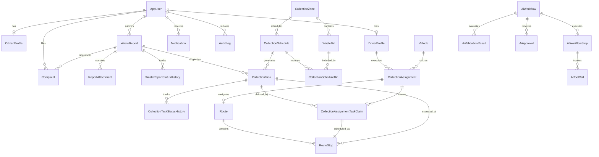

# SmartWaste — Database Schema Specification

> **Status:** FROZEN SOURCE OF TRUTH  
> **Target Database:** PostgreSQL 16+ via Entity Framework Core (Npgsql)  
> **Key Strategy:** GUID primary keys (`uuid`), UTC timestamps (`timestamptz`), strict foreign keys, deterministic business state lifecycles.

This document establishes the authoritative conceptual data model for the Smart Waste Management System. All entity designs, relations, enums, and indexes detailed here must be preserved during implementation. Final EF Core Fluent API configurations (`EntityTypeBuilder<T>`) will serve as the technical implementation authority, adhering strictly to this specification.

---

## 1. Architectural Conventions & Data Types

| Concept | Implementation Standard | PostgreSQL Type | Notes |
| :--- | :--- | :--- | :--- |
| **Primary Keys** | `Guid` (`System.Guid`) | `uuid` | Generated via `Guid.NewGuid()` / `gen_random_uuid()` unless defined by ASP.NET Core Identity. |
| **Foreign Keys** | `Guid` (`System.Guid`) | `uuid` | Enforces referential integrity with cascading rules documented per relationship. |
| **Timestamps** | `DateTime` (`System.DateTime`) | `timestamptz` | All timestamps **MUST** be stored in UTC (`DateTime.UtcNow`). |
| **Coordinates** | `double` / `decimal(9,6)` | `numeric(9,6)` / `double precision` | Latitude (-90.0 to 90.0) and Longitude (-180.0 to 180.0). |
| **Status / Enums** | C# Enum stored as `string` | `varchar(50)` | Stored as strings for clarity, readability, and migration stability. |
| **Text Payloads** | `string` | `varchar(n)` / `text` | Constrained `varchar` for codes/titles, `text` for descriptions and notes. |
| **Structured Payloads**| `string` / JSON | `jsonb` | Used for tool inputs/outputs and structured audit metadata. |

---

## 2. Identity and Shared Entities

### 2.1 `AppUser`
Extends `IdentityUser<Guid>`. Core user entity managed by ASP.NET Core Identity.

*Already implemented in `SmartWaste.Domain.Entities.AppUser`.*

| Field | Type | Nullable | Description |
| :--- | :--- | :--- | :--- |
| `Id` | `Guid` | No | PK inherited from `IdentityUser<Guid>` (`uuid`). |
| `UserName` | `string` | No | Inherited from Identity (matches Email normalized). |
| `Email` | `string` | No | Inherited from Identity. |
| `PhoneNumber` | `string` | Yes | Inherited from Identity. |
| `PasswordHash` | `string` | Yes | Inherited from Identity (hashed with PBKDF2). |
| `FullName` | `string` | No | User's display name (`varchar(150)`). |
| `IsActive` | `bool` | No | Account status flag (default: `true`). |
| `MustChangePassword` | `bool` | No | Mandatory first-login password change flag (default: `false`, set to `true` for manager-provisioned internal accounts). |
| `CreatedAt` | `DateTime` | No | UTC registration timestamp. |
| `UpdatedAt` | `DateTime` | Yes | UTC timestamp of last modification. |

#### Roles
Roles are managed via ASP.NET Core Identity roles (`IdentityRole<Guid>`):
- `Citizen`: General public user submitting reports and complaints (assigned by default on public registration).
- `WasteOfficer`: Field supervisor managing bins, verifying reports, and planning schedules.
- `Driver`: Municipal collection vehicle operator executing assigned collection tasks.
- `MunicipalManager`: Executive overseeing operations, resolving escalated complaints, and approving AI workflow recommendations.

---

### 2.2 `CitizenProfile`
One-to-one extension for users holding the `Citizen` role. *(Deferred — not required for Component 1 core waste reporting; `WasteReport.CitizenId` references `AppUser.Id` directly).*

| Field | Type | Nullable | Description |
| :--- | :--- | :--- | :--- |
| `UserId` | `Guid` | No | PK & FK to `AppUser.Id` (Cascade delete). |
| `Address` | `string` | Yes | Default residential or business address (`varchar(255)`). |
| `DefaultLatitude` | `double` | Yes | Preferred home/work latitude. |
| `DefaultLongitude` | `double` | Yes | Preferred home/work longitude. |
| `CreatedAt` | `DateTime` | No | UTC timestamp of profile creation. |
| `UpdatedAt` | `DateTime` | Yes | UTC timestamp of last modification. |

---

### 2.3 `DriverProfile`
Internal one-to-one availability extension automatically maintained for users holding the `Driver` role. It is not a separately registered or Manager-administered Driver record.

| Field | Type | Nullable | Description |
| :--- | :--- | :--- | :--- |
| `UserId` | `Guid` | No | PK & FK to `AppUser.Id` (Cascade delete). |
| `LicenseNumber` | `string` | Yes | Historical heavy/commercial vehicle driver licence number (`varchar(50)`). Non-null historical values remain unique; it is not required for Driver operations. |
| `AvailabilityStatus`| `string` | No | Availability state (`varchar(30)`). Default: `Available`. |
| `CreatedAt` | `DateTime` | No | UTC timestamp of profile creation. |
| `UpdatedAt` | `DateTime` | Yes | UTC timestamp of last modification. |

#### Driver Availability Status Lifecycle
- `Available`: Driver is on duty and may receive a new collection assignment when not occupied.
- `OffDuty`: Driver is off work, on leave, or inactive.

Assignment occupancy is derived from unfinished `CollectionAssignment` rows; it is not an availability status.

---

## 3. Component 1 — Waste Reporting & Citizen Management

### 3.1 `WasteReport`
Represents an illegal dumping or overflow report submitted by a citizen.

| Field | Type | Nullable | Description |
| :--- | :--- | :--- | :--- |
| `Id` | `Guid` | No | Primary Key (`uuid`). |
| `CitizenId` | `Guid` | No | FK to `AppUser.Id` (Reporter). Server-derived from authenticated JWT; no dependency on deferred `CitizenProfile`. Citizen must never supply arbitrary `CitizenId`. |
| `Description` | `string` | No | Detailed description of the waste site (`text`, 10–1000 characters). |
| `WasteType` | `string` | No | Categorization of reported waste (`varchar(50)`). |
| `Latitude` | `double` | No | Geospatial latitude of the report location (-90.0 to 90.0). |
| `Longitude` | `double` | No | Geospatial longitude of the report location (-180.0 to 180.0). |
| `AddressText` | `string` | Yes | Human-readable address or landmark description (`varchar(500)`). |
| `Status` | `string` | No | Current lifecycle status (`varchar(50)`). Default: `Submitted`. |
| `Priority` | `WasteReportPriority?` | Yes | Operational priority enum (`varchar(30)`: `Low`, `Medium`, `High`, `Urgent`). Nullable (`WasteReportPriority?`). Priority remains null during Component 1 verification. It may later be assigned only through authoritative ASP.NET business logic after operational/AI-assisted planning. AI may recommend but never persist it directly. |
| `VerifiedByUserId` | `Guid` | Yes | FK to `AppUser.Id` (WasteOfficer who verified the report). Set exclusively by backend during verification; null for other statuses. |
| `VerifiedAt` | `DateTime` | Yes | UTC timestamp when verified by WasteOfficer. Set exclusively by backend during verification. |
| `CreatedAt` | `DateTime` | No | UTC timestamp of submission. |
| `UpdatedAt` | `DateTime` | Yes | UTC timestamp of last update. |

#### Waste Types
- `General`: Mixed solid municipal waste.
- `Organic`: Food scraps, yard waste, biodegradable material.
- `Recyclable`: Paper, cardboard, plastics, glass, metals.
- `Hazardous`: Chemicals, batteries, e-waste, biological hazards.
- `Bulky`: Furniture, appliances, construction debris.
- `Other`: Uncategorized waste requiring field inspection.

#### Waste Report Priority Enum (`WasteReportPriority`)
`WasteReport.Priority` is formalized as a nullable domain enum `WasteReportPriority?`:
- `Low`
- `Medium`
- `High`
- `Urgent`

Persisted in PostgreSQL as `varchar(30)`. `WasteReport.Priority` remains `null` during Component 1 verification. It may later be assigned only through authoritative ASP.NET Core business logic after operational/AI-assisted planning. The AI service may recommend a priority, but has zero direct database connection and never persists it directly.

#### Waste Report Status Lifecycle & Transitions
```
Submitted ──> UnderReview ──> Verified ──> Scheduled ──> InProgress ──> Resolved
     │             │
     │             └──> Rejected
     │
     └──> Cancelled (by Citizen while Submitted)
```

##### Allowed Status Transitions
| From Status | To Status | Trigger / Action | Authorized Role | Preconditions & Business Rules |
| :--- | :--- | :--- | :--- | :--- |
| *(None)* | `Submitted` | `POST /api/v1/waste-reports` | `Citizen` | Valid payload; `CitizenId` set from JWT; initial status history created atomically. |
| `Submitted` | `UnderReview` | `POST /api/v1/waste-reports/{id}/start-review` | `WasteOfficer` | Report in `Submitted`; locks citizen editing/cancellation; history logged. Viewing does not start review. |
| `Submitted` | `Cancelled` | `DELETE /api/v1/waste-reports/{id}` | `Citizen` (Owner) | Report in `Submitted`; business cancellation (no hard delete); no citizen-supplied cancellation reason required (`Notes` is null or backend default "Cancelled by citizen"). |
| `UnderReview` | `Verified` | `POST /api/v1/waste-reports/{id}/verify` | `WasteOfficer` | Report in `UnderReview`; requires and persists a valid Priority, then sets `Status = Verified`, `VerifiedByUserId`, `VerifiedAt`, `UpdatedAt`; history logged. |
| `UnderReview` | `Rejected` | `POST /api/v1/waste-reports/{id}/reject` | `WasteOfficer` | Report in `UnderReview`; required `reason` (5–500 chars) stored in `WasteReportStatusHistory.Notes`. |
| `Verified` | `Scheduled` | Approved collection plan / authoritative `CollectionTask` creation | *Component 2 Operational Workflow (ASP.NET Core)* | Linked to planned `CollectionTask`. AI may recommend scheduling in later phases, but AI has zero direct write access to PostgreSQL; authoritative transition and task creation are executed solely via ASP.NET Core. |
| `Scheduled` | `InProgress` | Authoritative start of collection work associated with the report/task | *Component 3 Operational Workflow (ASP.NET Core)* | Triggered by the authoritative start of collection work associated with the report/task. Route, RouteStop, and WasteReport state transitions are kept conceptually separate. |
| `InProgress` | `Resolved` | Collection Completion | *Component 3 / Driver* | Waste collected and site cleared. |

> [!IMPORTANT]
> **No Hard Deletes:** `WasteReport` records are never physically removed from PostgreSQL. Citizen cancellation via `DELETE /api/v1/waste-reports/{id}` executes a business state transition to `Cancelled`, preserving full auditability, status history, and foreign key integrity.
>
> **Status Lifecycle Ownership:**
> - **Component 1:** Owns `Submitted`, `UnderReview`, `Verified`, `Rejected`, and `Cancelled`.
> - **Future Component 2:** Owns `Verified` → `Scheduled` (executed authoritatively via ASP.NET Core upon approved collection plan / `CollectionTask` creation).
> - **Future Component 3:** Owns `Scheduled` → `InProgress` (Trigger: Authoritative start of collection work associated with the report/task. Owner: Component 3 operational workflow through ASP.NET Core. Route, RouteStop, and WasteReport state transitions are kept conceptually separate) and `InProgress` → `Resolved` (collection completion and site clearance).
>
> **AI Eligibility Boundary & Roadmap:**
> - Only reports in `Verified` status are eligible inputs for automated AI collection planning. Reports in `Submitted`, `UnderReview`, `Rejected`, `Cancelled`, `Scheduled`, `InProgress`, or `Resolved` are strictly ineligible.
> - **AI Roadmap:** After deterministic Component 1 is implemented and verified, Step 9A.13 will expose an AI-safe Component 1 capability (`get_verified_waste_reports`), and Step 9A.14 will establish the Waste Analysis Agent foundation. Full Planner / LangGraph multi-agent orchestration remains deferred until subsequent components and tools exist.
> - **No Direct AI Writes:** The Python AI microservice has zero direct database connection and zero write access to PostgreSQL. AI is purely advisory; all state transitions and entity creations are executed authoritatively by ASP.NET Core.
>
> **No Generic Status PATCH:** Status transitions cannot be executed via generic PATCH or direct field updates. Every state transition is executed through its specific, authorized business operation endpoint and recorded in `WasteReportStatusHistory`.

---

### 3.2 `ReportAttachment`
Photographic evidence attached to a waste report.

| Field | Type | Nullable | Description |
| :--- | :--- | :--- | :--- |
| `Id` | `Guid` | No | Primary Key (`uuid`). |
| `WasteReportId` | `Guid` | No | FK to `WasteReport.Id` (Cascade delete). |
| `StorageKey` | `string` | No | Provider-independent object storage key/identifier (e.g., `waste-reports/{reportId}/{uniqueId}.ext`) (`varchar(500)`). Persisted key returned by configured cloud storage; domain does not store public URLs or image binaries in PostgreSQL. |
| `FileType` | `string` | No | MIME type (`image/jpeg`, `image/png`, `image/webp`) (`varchar(100)`). |
| `CreatedAt` | `DateTime` | No | UTC timestamp of upload. |

#### Cloud Storage Architecture & Attachment Constraints
- **Cloud/Object Storage Strategy:** Photographic attachments are persisted in a free cloud object storage service (exact provider to be selected in Step 9A.7; kept provider-independent so domain entities remain decoupled from AWS S3, Supabase, Cloudinary, Firebase, or Azure Blob).
- **Storage Abstraction:** Implementation will utilize an `IFileStorageService` abstraction (`UploadAsync`, `DeleteAsync`, `GetReadUrlAsync`).
- **Secure Image Access:** `fileUrl` is strictly an API response/display concern (e.g., short-lived signed read URL or authorized backend URL generated by `IFileStorageService`). Clients never depend on raw `StorageKey` or hold secret cloud credentials. Knowing a `StorageKey` does not grant access; viewing attachments is authorization-controlled.
- **Relationship:** 1 `WasteReport` → 0..3 `ReportAttachment` records (maximum 3 images per report).
- **Format Restrictions:** JPEG (`image/jpeg`), PNG (`image/png`), WebP (`image/webp`).
- **File Size Limit:** Maximum 5 MB per file.
- **Lifecycle Guard:** Attachments can only be uploaded (`POST /api/v1/waste-reports/{id}/attachments`) or removed (`DELETE /api/v1/waste-reports/{id}/attachments/{attachmentId}`) by the owner Citizen while the report is in `Submitted` status. Once `UnderReview` or later, attachments are permanently locked from modification.
- **Visibility:** Read-only for `WasteOfficer` and `MunicipalManager`.

---

### 3.3 `WasteReportStatusHistory`
Audit record tracking every state change for accountability, timeline visualization, and SLA tracking.

| Field | Type | Nullable | Description |
| :--- | :--- | :--- | :--- |
| `Id` | `Guid` | No | Primary Key (`uuid`). |
| `WasteReportId` | `Guid` | No | FK to `WasteReport.Id` (Cascade delete). |
| `FromStatus` | `string` | Yes | Previous status (`null` for initial `Submitted` creation). |
| `ToStatus` | `string` | No | New status (`varchar(50)`). |
| `ChangedByUserId`| `Guid` | Yes | FK to `AppUser.Id` who performed the transition (`null` for automated system events). |
| `Notes` | `string` | Yes | Rejection reason (required on reject, 5–500 chars), officer remarks (optional on start-review), or cancellation notes (optional/backend default, e.g. "Cancelled by citizen") (`text`). |
| `ChangedAt` | `DateTime` | No | UTC timestamp of change. |

#### Audit Behavior & Transaction Rules
- **Initial Submission:** Creation of a `WasteReport` atomically inserts an initial history record (`FromStatus = null`, `ToStatus = Submitted`, `ChangedByUserId = CitizenId`, `ChangedAt = CreatedAt`).
- **Atomic State Transitions:** All subsequent status transitions (`UnderReview`, `Verified`, `Rejected`, `Cancelled`, `Scheduled`, `InProgress`, `Resolved`) must insert a history record atomically in the same database transaction as the report update.
- **Rejection vs Cancellation Notes:**
  - When a report is rejected by a `WasteOfficer`, the mandatory rejection reason (5–500 characters) is persisted in `WasteReportStatusHistory.Notes`. No separate `RejectionReason` column exists on `WasteReport`.
  - When a report is cancelled by a `Citizen`, no cancellation reason is required; `Notes` is persisted as `null` or a backend default `"Cancelled by citizen"`.

## 4. Component 2 — Waste Collection & Bin Management

### 4.0 Architectural & Component Scope Overview
Component 2 manages public roadside waste bins, auditable manual fill/condition observations, configured routine collection weekdays, identification of collection needs (derived read model), individual collection task records, and manual/rescheduled task management.

- **Authoritative Gateway:** ASP.NET Core owns database persistence, business validation, C1 report synchronization, and task scheduling.
- **Physical Bins:** The system manages public roadside bins (no IoT sensors). Bins accept one or more waste types.
- **Three Separate Bin Concepts:**
  1. *Administrative Status:* Operational lifecycle state (`Active`, `OutOfService`, `Retired`).
  2. *Physical Condition:* Physical integrity state from latest observation (`Good`, `Damaged`, `Blocked`, `Missing`).
  3. *Observed Fill Level:* Manual discrete reading (`0%`, `25%`, `50%`, `75%`, `100%`). No observation means `Unknown`, not 0%.
- **Municipality Timezone:** Routine collection weekdays and local due dates are evaluated in the municipality's configured timezone (`Municipality:TimeZoneId`, e.g. `"Asia/Colombo"` / UTC+5:30). All database timestamps and `ScheduledAt` are stored in UTC (`timestamptz`).
- **Manual Observation Freshness:** Freshness threshold is **48 hours** based on authoritative server time. Observations older than 48 hours are stale; public availability falls back to `Unknown`.
- **Collection Needs as Derived Read Model:** Collection needs are derived dynamically from three sources (Verified WasteReports, Full/Blocked bins, Routine due bins). Collection needs are NOT stored in a persisted `CollectionNeed` table.
- **One Task = One Location:** A `CollectionTask` represents one collection job at one location targeting EITHER one `WasteReport` OR one `WasteBin` (enforced via database XOR check constraint).

---

### 4.1 `WasteBin`
Represents a registered municipal roadside public waste bin.

| Field | Type | Nullable | Description |
| :--- | :--- | :--- | :--- |
| `Id` | `Guid` | No | Primary Key (`uuid`). |
| `BinCode` | `string` | No | Unique municipal asset code, e.g., `BIN-COL-0042` (`varchar(50)`). **Unique**. |
| `CapacityLiters` | `int` | No | Total physical volume capacity in liters (e.g., 240, 660, 1100). Must be > 0. |
| `Latitude` | `double` | No | Geospatial latitude (-90.0 to 90.0). |
| `Longitude` | `double` | No | Geospatial longitude (-180.0 to 180.0). |
| `AddressText` | `string` | Yes | Human-readable address or landmark description (`varchar(500)`). |
| `AdministrativeStatus` | `string` | No | Administrative operational status (`varchar(50)`). Values: `Active`, `OutOfService`, `Retired`. Default: `Active`. |
| `CollectionWeekdays` | `int[]` | No | Routine collection weekdays stored as PostgreSQL integer array (`integer[]`). ISO 8601 day numbers (`1` = Monday ... `7` = Sunday). Validated duplicate-free; empty array `[]` allowed for on-demand bins. |
| `LastCollectedAt` | `DateTime` | Yes | UTC timestamp when collection was actually completed and verified (`timestamptz`). Set only upon actual collection completion, not task creation. |
| `CreatedAt` | `DateTime` | No | UTC creation timestamp (`timestamptz`). |
| `UpdatedAt` | `DateTime` | Yes | UTC timestamp of last metadata update (`timestamptz`). |

#### Database Constraints & Indexes
- **Unique Index:** `IX_WasteBins_BinCode` on `BinCode` (Unique).
- **Check Constraints:**
  - `CK_WasteBins_CapacityLiters`: `"CapacityLiters" > 0`
  - `CK_WasteBins_Coordinates`: `"Latitude" >= -90.0 AND "Latitude" <= 90.0 AND "Longitude" >= -180.0 AND "Longitude" <= 180.0`
  - `CK_WasteBins_AdministrativeStatus`: `"AdministrativeStatus" IN ('Active', 'OutOfService', 'Retired')`
- **Query Indexes:**
  - `IX_WasteBins_AdministrativeStatus` on `AdministrativeStatus`.
  - Spatial compound index: `IX_WasteBins_Coordinates` on `(Latitude, Longitude)`.

---

### 4.2 `WasteBinAcceptedWasteType`
Join entity defining accepted waste categories for a roadside bin. Enables multi-stream waste disposal at a single bin station.

| Field | Type | Nullable | Description |
| :--- | :--- | :--- | :--- |
| `WasteBinId` | `Guid` | No | PK & FK to `WasteBins.Id` (Cascade delete). |
| `WasteType` | `string` | No | PK. Reuses `SmartWaste.Domain.Reporting.Enums.WasteType` (`varchar(50)`: `General`, `Organic`, `Recyclable`, `Hazardous`, `Bulky`, `Other`). |

- **Composite Primary Key:** `(WasteBinId, WasteType)`.
- **Application Invariant:** Every registered bin must have at least one accepted waste type. Attempting to register or update a bin with zero accepted types is rejected with 400 BadRequest.

---

### 4.3 `BinObservation`
Append-only manual inspection record recording bin fill level and physical condition.

| Field | Type | Nullable | Description |
| :--- | :--- | :--- | :--- |
| `Id` | `Guid` | No | Primary Key (`uuid`). |
| `WasteBinId` | `Guid` | No | FK to `WasteBins.Id` (Cascade delete). |
| `FillLevelPercent` | `int` | No | Discrete estimated fill level (`int`). Permitted values: `0`, `25`, `50`, `75`, `100`. |
| `Condition` | `string` | No | Physical condition assessment (`varchar(30)`). Values: `Good`, `Damaged`, `Blocked`, `Missing`. |
| `Notes` | `string` | Yes | Field inspection remarks (`varchar(500)`). |
| `RecordedByUserId` | `Guid` | No | FK to `AppUsers.Id` (WasteOfficer now; authorized Driver in future C3) (Restrict delete). |
| `RecordedAt` | `DateTime` | No | Server-generated UTC timestamp of observation (`timestamptz`). |

#### Observation Invariants & Database Rules
- **Check Constraints:**
  - `CK_BinObservations_FillLevelPercent`: `"FillLevelPercent" IN (0, 25, 50, 75, 100)`
  - `CK_BinObservations_Condition`: `"Condition" IN ('Good', 'Damaged', 'Blocked', 'Missing')`
- **Append-Only Nature:** Observations are strictly immutable once created. No update or delete endpoints exist.
- **Deterministic Latest Observation:**
  The current observation for a bin is resolved by ordering: `RecordedAt DESC, Id DESC`.
- **Indexes:**
  - `IX_BinObservations_WasteBinId_RecordedAt` on `(WasteBinId, RecordedAt DESC)`.
  - `IX_BinObservations_RecordedByUserId` on `RecordedByUserId`.

---

### 4.4 `CollectionTask`
Authoritative unit of collection work dispatched to clear a verified citizen waste report OR empty a roadside bin.

| Field | Type | Nullable | Description |
| :--- | :--- | :--- | :--- |
| `Id` | `Guid` | No | Primary Key (`uuid`). |
| `TaskCode` | `string` | No | Unique municipal operational task code, e.g., `TSK-20260921-0042` (`varchar(50)`). **Unique**. |
| `WasteReportId` | `Guid` | Yes | FK to `WasteReports.Id` (Restrict delete). Non-null when task targets a citizen waste report. |
| `WasteBinId` | `Guid` | Yes | FK to `WasteBins.Id` (Restrict delete). Non-null when task targets a roadside bin. |
| `CollectionReason` | `string` | No | Operational reason justifying task creation (`varchar(50)`). Values: `VerifiedReport`, `FullOrBlockedBin`, `RoutineCollection`, `OfficerDiscretion`. |
| `Status` | `string` | No | Lifecycle status (`varchar(50)`). Values: `Scheduled`, `Assigned`, `InProgress`, `Completed`, `Failed`, `Cancelled`. Default: `Scheduled`. |
| `ScheduledAt` | `DateTime` | No | Planned target UTC timestamp when collection is scheduled to be performed (`timestamptz`). Must be >= creation time. |
| `HandlingNotes` | `string` | Yes | Operational instructions for collection crew (e.g. access directions, hazard warnings) (`text`). Optional; must not substitute for `SchedulingReason`. |
| `SchedulingReason` | `string` | Yes | Officer justification explaining the scheduling decision (`text`). Strictly mandatory (non-empty, 5–500 chars) when `CollectionReason = 'OfficerDiscretion'`. Distinct from operational `HandlingNotes`. |
| `CreatedByUserId` | `Guid` | No | FK to `AppUsers.Id` (WasteOfficer who created task) (Restrict delete). Sourced from JWT; never client-supplied. |
| `CreationMethod` | `string` | No | Method of creation (`varchar(30)`). Values: `Manual`, `ApprovedAiPlan`. Default: `Manual`. |
| `TriggerObservationId` | `Guid` | Yes | Optional FK to `BinObservations.Id` (`SetNull` delete). Records the specific observation that triggered collection when `CollectionReason = 'FullOrBlockedBin'`. |
| `RoutineDueDate` | `DateOnly` | Yes | Optional municipality local calendar date (`date`) recording which routine collection day triggered this task when `CollectionReason = 'RoutineCollection'`. |
| `CreatedAt` | `DateTime` | No | Server-generated UTC creation timestamp (`timestamptz`). |
| `UpdatedAt` | `DateTime` | Yes | UTC timestamp of last metadata update (`timestamptz`). |

#### CollectionTask Database Constraints & Indexes
- **Target XOR Check Constraint:** Exactly one target must be populated:
  ```sql
  CONSTRAINT "CK_CollectionTasks_Target_XOR" CHECK (
      ("WasteReportId" IS NOT NULL AND "WasteBinId" IS NULL) OR
      ("WasteReportId" IS NULL AND "WasteBinId" IS NOT NULL)
  )
  ```
- **Reason-Target Consistency Check Constraint:**
  ```sql
  CONSTRAINT "CK_CollectionTasks_Reason_Consistency" CHECK (
      ("WasteReportId" IS NOT NULL AND "CollectionReason" = 'VerifiedReport') OR
      ("WasteBinId" IS NOT NULL AND "CollectionReason" IN ('FullOrBlockedBin', 'RoutineCollection', 'OfficerDiscretion'))
  )
  ```
- **Officer Discretion Justification Check Constraint:**
  ```sql
  CONSTRAINT "CK_CollectionTasks_OfficerDiscretion_Reason" CHECK (
      ("CollectionReason" != 'OfficerDiscretion') OR
      ("SchedulingReason" IS NOT NULL AND LENGTH(TRIM("SchedulingReason")) > 0)
  )
  ```
- **Status Enum Check Constraint:**
  ```sql
  CONSTRAINT "CK_CollectionTasks_Status" CHECK (
      "Status" IN ('Scheduled', 'Assigned', 'InProgress', 'Completed', 'Failed', 'Cancelled')
  )
  ```
- **Unique Code Index:** `IX_CollectionTasks_TaskCode` on `TaskCode` (Unique).
- **Duplicate Active Task Filtered Unique Indexes:**
  To guarantee that no more than ONE active collection task (`Scheduled`, `Assigned`, or `InProgress`) exists concurrently for the same target:
  ```sql
  CREATE UNIQUE INDEX "IX_CollectionTasks_WasteReportId_Active"
  ON "CollectionTasks" ("WasteReportId")
  WHERE "WasteReportId" IS NOT NULL AND "Status" IN ('Scheduled', 'Assigned', 'InProgress');

  CREATE UNIQUE INDEX "IX_CollectionTasks_WasteBinId_Active"
  ON "CollectionTasks" ("WasteBinId")
  WHERE "WasteBinId" IS NOT NULL AND "Status" IN ('Scheduled', 'Assigned', 'InProgress');
  ```
- **Operational Query Indexes:**
  - `IX_CollectionTasks_Status_ScheduledAt` on `(Status, ScheduledAt)`.
  - `IX_CollectionTasks_CreatedByUserId` on `CreatedByUserId`.

---

### 4.5 `CollectionTaskStatusHistory`
Chronological audit record tracking every lifecycle status transition of a `CollectionTask`.

| Field | Type | Nullable | Description |
| :--- | :--- | :--- | :--- |
| `Id` | `Guid` | No | Primary Key (`uuid`). |
| `CollectionTaskId` | `Guid` | No | FK to `CollectionTasks.Id` (Cascade delete). |
| `FromStatus` | `string` | Yes | Previous status (`varchar(50)`). Null for initial creation. |
| `ToStatus` | `string` | No | New status (`varchar(50)`). |
| `ChangedByUserId` | `Guid` | Yes | FK to `AppUsers.Id` (Restrict delete). User who triggered transition; null only for automated system events. |
| `Notes` | `string` | Yes | Audit notes, cancellation reason, or failure details (`text`). |
| `ChangedAt` | `DateTime` | No | Server-generated UTC timestamp of transition (`timestamptz`). |

- **Atomic Status Change:** Every task status change (`Assigned`, `InProgress`, `Completed`, `Failed`, `Cancelled`) must insert a history record in the same database transaction.
- **Index:** `IX_CollectionTaskStatusHistories_TaskId_ChangedAt` on `(CollectionTaskId, ChangedAt ASC)`.

---

### 4.6 `CollectionTaskScheduleHistory`
Dedicated audit entity capturing changes to the planned execution time (`ScheduledAt`) of an unstarted (`Scheduled`) collection task.

| Field | Type | Nullable | Description |
| :--- | :--- | :--- | :--- |
| `Id` | `Guid` | No | Primary Key (`uuid`). |
| `CollectionTaskId` | `Guid` | No | FK to `CollectionTasks.Id` (Cascade delete). |
| `PreviousScheduledAt`| `DateTime` | No | Prior planned UTC timestamp (`timestamptz`). |
| `NewScheduledAt` | `DateTime` | No | Newly planned UTC timestamp (`timestamptz`). Must be > UtcNow. |
| `Reason` | `string` | No | Mandatory officer explanation for rescheduling (5–500 chars) (`text`). |
| `RescheduledByUserId`| `Guid` | No | FK to `AppUsers.Id` (WasteOfficer) (Restrict delete). |
| `RescheduledAt` | `DateTime` | No | Server-generated UTC timestamp of rescheduling event (`timestamptz`). |

- **Design Rationale:** Rescheduling an unstarted task does not alter its lifecycle state (`Scheduled` remains `Scheduled`). Recording the old time, new time, officer ID, and mandatory reason in a dedicated schedule history table guarantees complete auditability without polluting `CollectionTaskStatusHistory` with artificial `Scheduled → Scheduled` self-transitions.
- **Precondition:** Rescheduling is permitted ONLY when `Status == Scheduled`. Once a task moves to `Assigned` or `InProgress`, rescheduling via C2 is rejected with `409 Conflict`.
- **Index:** `IX_CollectionTaskScheduleHistories_TaskId_RescheduledAt` on `(CollectionTaskId, RescheduledAt ASC)`.

---

### 4.7 Collection Needs Read Model (Derived, Non-Persisted)
`CollectionNeed` is a derived read model computed dynamically by ASP.NET Core from three eligible operational sources:

```
Source A: Verified Citizen WasteReports (Status == Verified, no active task)
Source B: Active WasteBins with Latest Observation (100% Full OR Blocked, no active task)
Source C: Active WasteBins Due for Routine Collection on Configured Weekdays (no active task)
                                  │
                                  ▼
                Unified Collection Needs Queue
                   (GET /api/v1/collection-needs)
```

#### Collection Need Item Projection (`CollectionNeedItemDto`)
- `id`: Target ID (`WasteReportId` or `WasteBinId`).
- `reportReference`: Display-only first eight uppercase UUID hex characters for report needs; no stored column and never an identity key.
- `targetType`: `"Report"` or `"Bin"`.
- `collectionReason`: `"VerifiedReport"`, `"FullOrBlockedBin"`, or `"RoutineCollection"`.
- `title`: Short descriptive title (e.g. `BIN-COL-0042 (Full: 100%)` or `Report <derived reference>: Pettah Market`).
- `latitude`, `longitude`: Geospatial coordinates.
- `addressText`: Location description.
- `wasteType`: Primary or accepted waste categories.
- `urgency`: Advisory priority indicator (`Urgent`, `High`, `Medium`, `Low`).
- `triggerDate`: UTC timestamp when the need originated (verified date, observation date, or routine due date).
- `attachmentCount`: File attachment count (for reports).
- `latestObservation`: Summary of latest observation (for bins: fill level, condition, age in hours).

#### Active Task Suppression Rule
If a target already has an associated `CollectionTask` in status `Scheduled`, `Assigned`, or `InProgress`, it is **strictly excluded** from the collection needs queue. This prevents duplicate dispatch and visual clutter in the WasteOfficer operational dashboard.

---

### 4.8 Deterministic Routine Due Calculation Specification

The determination of whether a registered bin is due for routine collection on a given date is computed by a deterministic domain algorithm operating in the municipality's configured local timezone (`Municipality:TimeZoneId = "Asia/Colombo"`):

```
Let localNow = TimeZoneInfo.ConvertTimeFromUtc(DateTime.UtcNow, municipalityTimeZone)
Let localToday = DateOnly.FromDateTime(localNow)
Let localTodayWeekday = (int)localToday.DayOfWeek == 0 ? 7 : (int)localToday.DayOfWeek   // ISO 8601: 1=Mon .. 7=Sun
```

#### Algorithmic Invariants & Edge Cases:
1. **Bin Has Never Been Collected (`LastCollectedAt == null`):**  
   If `localTodayWeekday ∈ CollectionWeekdays`, the bin is due today. If today is not a configured weekday, but configured weekdays exist, the bin is outstanding for the earliest configured weekday following its `CreatedAt` local date.
2. **Multiple Configured Weekdays (e.g. Monday and Thursday):**  
   The bin becomes due on each configured weekday.
3. **Missed Collection Day:**  
   If a bin was due on Monday (e.g. Sept 15), but no task was scheduled or completed, on Tuesday (Sept 16) the bin **remains outstanding** with `RoutineDueDate = 2026-09-15` until a collection is completed.
4. **Task Scheduled for a Later Day:**  
   If a routine need arose on Monday, and an Officer manually schedules the task for Wednesday, the bin has an active task (`Status = Scheduled`). The active-task suppression rule removes the bin from the queue.
5. **Active Task Spanning Another Routine Weekday:**  
   If an active task created for Monday's routine run is still `Scheduled` or `InProgress` when Thursday arrives, the filtered unique index and suppression rule prevent creating a second task. The single existing active task covers the location.
6. **Collection Completed After Due Date:**  
   When a collection completes on Wednesday for a task originally due on Monday, C3 sets `LastCollectedAt = UtcNow`. For the remainder of Wednesday, the bin is NOT due. It will become due next on Thursday.
7. **Weekday Configuration Changes:**  
   If an officer updates `CollectionWeekdays` from `[1]` (Mon) to `[1, 4]` (Mon, Thu), the new schedule takes effect immediately based on `localToday` and `LastCollectedAt`.
8. **Registration / Completion on a Configured Weekday:**  
   If a bin is collected on Monday at 10:00 AM local time, `LastCollectedAt` reflects Monday. The routine calculation checks: has a collection occurred since the start of Monday local day? Since `LastCollectedAt >= localMondayStart`, the bin is NOT due again on Monday.
9. **UTC vs Local Date Offset:**  
   UTC 22:00 Sunday is 03:30 Monday in Colombo (UTC+5:30). The routine due check converts UTC now to Colombo time, correctly identifying Monday as the operative day.

---

### 4.9 Public Availability Derivation & Freshness State Machine

Public roadside bins are queried by citizens to find usable disposal points. The public availability status is derived strictly on the server according to this frozen precedence hierarchy:

```
                   ┌────────────────────────────────────────┐
                   │ WasteBin.AdministrativeStatus          │
                   │ ∈ {OutOfService, Retired}?             │
                   └───────────────────┬────────────────────┘
                                       │ Yes ──> UNAVAILABLE
                                       │ No
                   ┌───────────────────▼────────────────────┐
                   │ Latest BinObservation.Condition        │
                   │ ∈ {Damaged, Blocked, Missing}?         │
                   └───────────────────┬────────────────────┘
                                       │ Yes ──> UNAVAILABLE
                                       │ No
                   ┌───────────────────▼────────────────────┐
                   │ Observation is Missing OR              │
                   │ (ServerUtcNow - RecordedAt) > 48h?     │
                   └───────────────────┬────────────────────┘
                                       │ Yes ──> UNKNOWN
                                       │ No
                   ┌───────────────────▼────────────────────┐
                   │ Fresh Observation (Age <= 48h):        │
                   │ FillLevelPercent == 100%?              │
                   └───────────────────┬────────────────────┘
                                       │ Yes ──> FULL (Unavailable)
                                       │ No
                   ┌───────────────────▼────────────────────┐
                   │ Fresh Observation (Age <= 48h):        │
                   │ FillLevelPercent == 75%?               │
                   └───────────────────┬────────────────────┘
                                       │ Yes ──> WARNING (Usable)
                                       │ No
                                       ▼
                                     USABLE (Fill < 75%)
```

- **Inspection & Maintenance Alerts:** Bins with latest condition `Damaged` or `Missing` trigger an inspection alert on WasteOfficer and MunicipalManager operational views. They do NOT generate ordinary collection tasks.
- **Stale Observation Integrity:** A stale 100% observation remains visible in internal history logs as an auditable historical measurement, but public citizen views display `Unknown` availability to avoid presenting outdated data as live fact.

---

### 4.10 C1 Lifecycle Synchronization & Atomic Transaction Contract

Creating a collection task for a verified citizen waste report bridges Component 1 and Component 2:

$$\text{WasteReport (Verified)} + \text{New CollectionTask (Scheduled)} \xrightarrow[\text{Transaction}]{\text{Atomic}} \begin{cases} \text{WasteReport.Status} = \text{Scheduled} \\ \text{WasteReportStatusHistory} \leftarrow (\text{Verified} \to \text{Scheduled}) \\ \text{CollectionTask} \leftarrow \text{Created (Scheduled)} \\ \text{CollectionTaskStatusHistory} \leftarrow (\text{null} \to \text{Scheduled}) \end{cases}$$

#### Atomic Persistence Guarantees & C1 History Schema Integrity
1. **Precondition Guard:** The report must be in `Status == WasteReportStatus.Verified`. Any other status returns `409 Conflict`.
2. **Concurrency & Uniqueness:** If another officer or concurrent process attempts to schedule the same report, the partial unique index `IX_CollectionTasks_WasteReportId_Active` throws a uniqueness violation, returning `409 Conflict`.
3. **Rollback Guarantee:** If updating the report status, inserting task history, or creating the task fails, the entire database transaction rolls back. No orphaned task and no unscheduled report state can persist.
4. **No Generic Public Status PATCH:** WasteReport status cannot be changed to `Scheduled` via any public PATCH endpoint. It can only transition through the authoritative `POST /api/v1/collection-tasks/manual` endpoint.
5. **Exact C1 Status History Entity Contract:**
   - Appending to C1 status history uses the exact existing `WasteReportStatusHistory` domain entity and table:
     - `WasteReportId = report.Id`
     - `FromStatus = WasteReportStatus.Verified`
     - `ToStatus = WasteReportStatus.Scheduled`
     - `ChangedByUserId = actorUserId` (authenticated WasteOfficer ID; not `SubmittedByUserId`)
     - `Notes = $"Collection task {task.TaskCode} scheduled"` (stored strictly in existing `Notes` property; not `Reason`)
     - `ChangedAt = DateTime.UtcNow`
   - C2 scheduling adheres strictly to the existing C1 schema (`ChangedByUserId`, `Notes`) and appends this audit record through an authorized application-service boundary (`SmartWaste.Application`). No new C1 properties or schema changes are introduced.

---

### 4.11 C3 Execution, Terminal Outcomes, Requeue, and Replacement Contract

`Completed`, `Failed`, and `Cancelled` remain terminal historical `CollectionTask` states. A Failed task is never changed to `Cancelled` or back to `Scheduled`; all C3 execution operations append the existing `CollectionTaskStatusHistory` record with server UTC time and the authenticated actor.

#### Required C3 atomic transitions

1. **Assignment:** C3 assigns only existing `Scheduled` tasks. It changes each task to `Assigned`, writes task history, creates the assignment, route, stops, and active claims atomically. A report remains `Scheduled` at this stage.
2. **Start:** Starting an assigned run changes each remaining assigned task to `InProgress`. For each report-targeted task, the authoritative C3/C1 service boundary also changes the report `Scheduled → InProgress` and writes `WasteReportStatusHistory` in the same transaction.
3. **Successful stop:** Completing a report task changes it to `Completed`, changes its report `InProgress → Resolved`, and writes both histories atomically. Completing a bin task changes it to `Completed` and sets `WasteBin.LastCollectedAt = UtcNow` atomically. Completion never fabricates a `BinObservation`.
4. **Failed stop:** Failing a stop requires a non-empty reason; it changes only that task to `Failed`, preserves the source report without a false `Resolved` transition, and leaves other stops executable. A failed task remains historical and auditable.
5. **Assignment finalization:** Only when every stop is `Completed` or `Failed` may C3 set the assignment to `Completed` (all completed), `PartiallyCompleted` (mixed), or `Failed` (all failed), with assignment history.
6. **Unstarted cancellation/requeue:** Only an `Assigned` assignment may be cancelled. In one transaction each still-Assigned task changes `Assigned → Scheduled`, receives a task history entry, and retains its existing `ScheduledAt`; the assignment becomes `Cancelled`, its claims are released, and driver/vehicle occupancy is released. Underlying tasks are not cancelled.

#### Replacement tasks after failure

Initial scheduling through `POST /api/v1/collection-tasks/manual` remains restricted to a report in `Verified` status and is not a replacement operation.

- **Report target:** the dedicated C3 replacement command requires the original task to be terminal `Failed`, the same source report to still be in `InProgress`, no active task/claim for that report, and a 5–500 character replacement reason. It creates a **new** `Scheduled` task and changes the report `InProgress → Scheduled`, recording a C1 history note that identifies both the failed and replacement task codes. It never resets the report to `Verified` and never changes the failed task.
- **Bin target:** the dedicated C3 replacement command requires a terminal Failed original bin task, authenticated WasteOfficer action, a 5–500 character replacement reason, no active task/claim, an active bin, and fresh authoritative revalidation that collection is still needed for the original collection reason. It creates a **new** Scheduled task and retains the failed task/history. No separate review entity or close-review workflow is introduced in the initial release; the replacement command itself is the required recorded officer review.

#### Post-collection bin state

`LastCollectedAt` means collection completion, not an observed fill level. The current collection-need service treats an observation recorded on or before `LastCollectedAt` as pre-collection and therefore not an acute full/blocked trigger; routine eligibility is recalculated using the configured municipality-local date. Public availability still follows the existing precedence and freshness rules: it is not promised to be `Usable` or empty after collection unless a qualifying fresh observation supports that conclusion. A Driver may later append a genuine, authorised post-collection observation through the C3-scoped C2 observation operation; its timestamp and actor remain server-derived.

---

## 5. Component 3 — Fleet, Driver & Route Management

> **Contract status:** Planned. These entities extend the implemented single-target `CollectionTask` model; they do not replace it. All timestamps are UTC (`timestamptz`) and all identifiers are `Guid`/`uuid` unless stated otherwise.

### 5.1 `DriverProfile`
One-to-one internal availability extension automatically created and backfilled for an existing `AppUser` in the `Driver` role. Driver identity and authentication remain ASP.NET Core Identity responsibilities; a profile is never a second account or a Manager-administered registration step.

| Field | Type | Nullable | Description |
| :--- | :--- | :--- | :--- |
| `UserId` | `Guid` | No | PK and FK to `AppUser.Id` (cascade delete). |
| `LicenseNumber` | `string` | Yes | Historical municipal commercial-driver licence identifier (`varchar(50)`). Existing non-null values remain unique; a new internal profile stores `NULL`. |
| `AvailabilityStatus` | `string enum` | No | Driver-declared duty indication. Default `Available`. |
| `IsEligible` | `bool` | No | Legacy historical administrative value, retained but not used as a dispatch gate. |
| `EligibilityNotes` | `string` | Yes | Legacy historical administrative notes, retained but not used by active workflows. |
| `CreatedAt` | `DateTime` | No | Profile creation time. |
| `UpdatedAt` | `DateTime` | Yes | Last administrative or availability update. |

`AvailabilityStatus` is `Available` or `OffDuty`. It is not an occupancy flag: a Driver with an unfinished assignment cannot use an availability change to release that assignment. A new assignment requires a Driver-role account with its internal profile, `AvailabilityStatus == Available`, and no unfinished assignment; legacy `IsEligible` does not gate dispatch. An assigned Driver retains established execution authority if they later become `OffDuty`.

### 5.2 `Vehicle` and `VehicleSupportedWasteType`
Municipal fleet resource. Capacity is always recorded in **litres** in this initial contract; it is reference information only and is not a task-load estimate.

| `Vehicle` Field | Type | Nullable | Description |
| :--- | :--- | :--- | :--- |
| `Id` | `Guid` | No | Primary key. |
| `RegistrationNumber` | `string` | No | Fleet/legal identifier (`varchar(50)`, unique). |
| `VehicleType` | `string enum` | No | `Compactor`, `Flatbed`, `Tipper`, or `SmallVan`. |
| `CapacityLiters` | `int` | No | Positive recorded vehicle capacity in litres. |
| `OperationalStatus` | `string enum` | No | `Available`, `Maintenance`, or `Inactive`. Default `Available`. |
| `Notes` | `string` | Yes | Administrative notes (`varchar(1000)`). |
| `CreatedAt` / `UpdatedAt` | `DateTime` | No / Yes | Audit timestamps. |

`VehicleSupportedWasteType` is structured compatibility data: `VehicleId` (FK, cascade delete), `WasteType` (the existing shared waste-type enum), and composite PK `(VehicleId, WasteType)`. A vehicle is not manually marked `Assigned`; its current occupancy is derived from an unfinished `CollectionAssignment`.

For the simple MVP, compatibility is classified from recorded type metadata only: a report is `Compatible` when its single recorded `WasteType` is supported and `Incompatible` when it is not; a bin is `Incompatible` only when its non-empty accepted-type set has no overlap with the vehicle’s supported set. Missing bin types, or a bin whose accepted types both overlap and differ from vehicle support, are `RequiresConfirmation` because accepted types do not prove the actual mixed contents. This classification never estimates volume or compartments.

### 5.3 `CollectionAssignment`, history, and task claims
An assignment groups multiple existing **Scheduled** C2 tasks for one Driver and one Vehicle. It contains no second time-window or target model; each underlying task keeps its own authoritative `ScheduledAt`, report/bin XOR target, collection reason, and C2 histories.

| `CollectionAssignment` Field | Type | Nullable | Description |
| :--- | :--- | :--- | :--- |
| `Id` | `Guid` | No | Primary key. |
| `DriverId` | `Guid` | No | FK to `DriverProfile.UserId` / `AppUser.Id` (restrict delete). |
| `VehicleId` | `Guid` | No | FK to `Vehicle.Id` (restrict delete). |
| `AssignedByUserId` | `Guid` | No | FK to the authenticated WasteOfficer who created the ordinary manual assignment (restrict delete). |
| `Status` | `string enum` | No | Assignment lifecycle; default `Assigned`. |
| `CompatibilityAcknowledgement` | `string` | Yes | Required 5–500 character officer confirmation only when backend classifies the selected work as unknown or ambiguous compatibility. |
| `CompatibilityAcknowledgedByUserId` / `CompatibilityAcknowledgedAt` | `Guid` / `DateTime` | Yes | Actor and time for the required acknowledgement. |
| `AssignedAt`, `StartedAt`, `FinalizedAt`, `CancelledAt` | `DateTime` | No / Yes / Yes / Yes | Lifecycle timestamps. |
| `CancellationReason` | `string` | Yes | Required 5–500 characters only for an unstarted cancellation. |
| `CreatedAt` / `UpdatedAt` | `DateTime` | No / Yes | Audit timestamps. |

Assignment statuses are `Assigned`, `InProgress`, `Completed`, `PartiallyCompleted`, `Failed`, and `Cancelled`. `Assigned` and `InProgress` are unfinished; all other states are terminal. There is no `Accepted`, `Skipped`, or driver transfer state.

`CollectionAssignmentStatusHistory` records every assignment transition: `Id`, `CollectionAssignmentId` (FK, cascade delete), nullable `FromStatus`, `ToStatus`, `ChangedByUserId` (FK AppUser, restrict delete), optional `Notes` (max 500), and `ChangedAt`.

`CollectionAssignmentTaskClaim` is the concrete, auditable assignment/task link:

| Field | Type | Nullable | Description |
| :--- | :--- | :--- | :--- |
| `Id` | `Guid` | No | Primary key. |
| `CollectionAssignmentId` | `Guid` | No | FK to `CollectionAssignment.Id` (restrict delete). |
| `CollectionTaskId` | `Guid` | No | FK to existing `CollectionTask.Id` (restrict delete). |
| `IsActive` | `bool` | No | True while the task is claimed by an unfinished assignment; released only on terminal task handling or assignment cancellation. |
| `ClaimedAt` / `ReleasedAt` | `DateTime` | No / Yes | Claim lifecycle timestamps. |
| `ReleasedByUserId` | `Guid` | Yes | FK to actor releasing a claim (restrict delete). |
| `ReleaseReason` | `string` | Yes | Audit reason for terminal release or cancellation requeue (max 500). |

Historical claims are retained. Cancelling an unstarted assignment marks its claims inactive only after the associated task requeue and history writes succeed; it does not delete tasks, stops, claims, or histories.

### 5.4 `Route` and `RouteStop`
Every assignment has one route containing its ordered task stops. The route is the assignment’s ordering and optional verified-routing result; task lifecycle remains authoritative in `CollectionTask`.

| `Route` Field | Type | Nullable | Description |
| :--- | :--- | :--- | :--- |
| `Id` | `Guid` | No | Primary key. |
| `CollectionAssignmentId` | `Guid` | No | Unique FK to `CollectionAssignment.Id` (cascade delete). |
| `RoutingMethod` | `string enum` | No | `ManualOrder` initially; `VerifiedProvider` only when an approved provider actually returned verified route data. |
| `RouteGeometry` | `string` | Yes | Provider-returned geometry only; no geometry is implied for manual ordering. |
| `EstimatedDistanceMeters` / `EstimatedDurationSeconds` | `double` | Yes | Provider-verified estimates only; nullable for manual order. |
| `CreatedAt` / `UpdatedAt` | `DateTime` | No / Yes | Audit timestamps. |

| `RouteStop` Field | Type | Nullable | Description |
| :--- | :--- | :--- | :--- |
| `Id` | `Guid` | No | Primary key. |
| `RouteId` | `Guid` | No | FK to `Route.Id` (cascade delete). |
| `CollectionTaskId` | `Guid` | No | FK to exactly one existing C2 `CollectionTask` (restrict delete). It is the only target reference. |
| `CollectionAssignmentTaskClaimId` | `Guid` | No | FK to the assignment’s matching task claim (restrict delete). |
| `Sequence` | `int` | No | Positive, officer-managed execution order. |
| `Status` | `string enum` | No | `Pending`, `Completed`, or `Failed`; default `Pending`. |
| `CompletedAt` / `FailedAt` | `DateTime` | Yes | Exactly one is set for the corresponding terminal state. |
| `FailureReason` | `string` | Yes | Required 5–500 characters if `Status == Failed`; forbidden otherwise. |
| `CreatedAt` / `UpdatedAt` | `DateTime` | No / Yes | Audit timestamps. |

`RouteStopStatusHistory` records every stop transition using the same actor/time/notes pattern as other histories. A stop cannot be marked terminal twice. A route stop never stores its own report/bin foreign keys, independently editable coordinates, or obsolete `Skipped` state.

### 5.5 PostgreSQL constraints and indexes

- `DriverProfile.UserId` is PK; `DriverProfile.LicenseNumber` is nullable and unique when non-null.
- `Vehicle.RegistrationNumber` is unique; `VehicleSupportedWasteType` uses composite PK `(VehicleId, WasteType)`.
- `Route.CollectionAssignmentId` is unique; `(RouteId, Sequence)` is unique and `Sequence > 0`.
- `CollectionAssignmentTaskClaim` is unique for `(CollectionAssignmentId, CollectionTaskId)` and has a **partial unique index** on `CollectionTaskId WHERE IsActive = true`. This directly enforces one unfinished assignment claim per task without a join.
- `RouteStop.CollectionAssignmentTaskClaimId` is unique. Its composite FK `(CollectionAssignmentTaskClaimId, CollectionTaskId)` references the claim’s unique `(Id, CollectionTaskId)` pair, enforcing that the stop and claim name the same task.
- `CollectionAssignment` has partial unique indexes on `DriverId` and `VehicleId` where `Status IN ('Assigned', 'InProgress')`. These predicates use columns on the assignment row and are PostgreSQL-enforceable without a join.
- A creation/cancellation/finalization transaction also revalidates the C2 task status and active claim under database concurrency control; indexes complement, rather than replace, that authoritative service validation.
- Check constraints enforce all documented enums, positive `CapacityLiters`, required cancellation reason, required failure reason, and timestamp/state consistency.

---

## 6. Component 4 — Operations, Complaints & Analytics

### 6.1 `Complaint`
Represents a citizen grievance regarding service quality (missed pickup, spilled waste, driver misconduct). **Distinct from a `WasteReport`**.

| Field | Type | Nullable | Description |
| :--- | :--- | :--- | :--- |
| `Id` | `Guid` | No | Primary Key (`uuid`). |
| `CitizenId` | `Guid` | No | FK to `AppUser.Id` (Complainant). |
| `WasteReportId` | `Guid` | Yes | Optional FK to `WasteReport.Id` if complaint relates to a specific report. |
| `Subject` | `string` | No | Complaint title (`varchar(200)`). |
| `Description` | `string` | No | Full grievance description (`text`). |
| `Status` | `string` | No | Lifecycle status (`varchar(50)`). Default: `Open`. |
| `AssignedOfficerId`| `Guid` | Yes | FK to `AppUser.Id` (Investigating WasteOfficer / Manager). |
| `ResolutionNotes` | `string` | Yes | Official resolution explanation provided to citizen (`text`). |
| `CreatedAt` | `DateTime` | No | UTC submission timestamp. |
| `UpdatedAt` | `DateTime` | Yes | UTC update timestamp. |
| `ResolvedAt` | `DateTime` | Yes | UTC resolution timestamp. |

#### Complaint Status Values
- `Open`: Newly filed by citizen.
- `UnderReview`: Officer actively investigating.
- `InProgress`: Corrective action dispatched.
- `Resolved`: Addressed and closed with explanatory notes.
- `Rejected`: Deemed invalid or unsubstantiated.

---

### 6.2 `OperationalIncident`
Field problem reported by drivers, officers, or dispatchers during collection (e.g., road blockage, vehicle breakdown, bin damage).

| Field | Type | Nullable | Description |
| :--- | :--- | :--- | :--- |
| `Id` | `Guid` | No | Primary Key (`uuid`). |
| `CollectionAssignmentId` | `Guid` | Yes | Optional FK to `CollectionAssignment.Id`. |
| `ReportedByUserId` | `Guid` | No | FK to `AppUser.Id` (Reporter). |
| `Type` | `string` | No | Incident category (`Breakdown`, `Blockage`, `Accident`, `Damage`) (`varchar(50)`). |
| `Description` | `string` | No | Incident details (`text`). |
| `Severity` | `string` | No | Severity level (`Low`, `Medium`, `High`, `Critical`). |
| `Status` | `string` | No | Incident state (`Open`, `Investigating`, `Resolved`) (`varchar(50)`). |
| `CreatedAt` | `DateTime` | No | UTC incident logging timestamp. |
| `ResolvedAt` | `DateTime` | Yes | UTC resolution timestamp. |

---

### 6.3 `Notification`
In-app and push notification record for all platform users.

| Field | Type | Nullable | Description |
| :--- | :--- | :--- | :--- |
| `Id` | `Guid` | No | Primary Key (`uuid`). |
| `UserId` | `Guid` | No | FK to `AppUser.Id` (Recipient). |
| `Title` | `string` | No | Notification header (`varchar(200)`). |
| `Message` | `string` | No | Notification content (`text`). |
| `Type` | `string` | No | Notification category (`ReportUpdate`, `TaskAssigned`, `IncidentAlert`, `System`) (`varchar(50)`). |
| `IsRead` | `bool` | No | Read receipt flag (default: `false`). |
| `CreatedAt` | `DateTime` | No | UTC creation timestamp. |
| `ReadAt` | `DateTime` | Yes | UTC read timestamp. |

---

### 6.4 `AuditLog`
Immutable compliance and security ledger recording all high-impact actions.

| Field | Type | Nullable | Description |
| :--- | :--- | :--- | :--- |
| `Id` | `Guid` | No | Primary Key (`uuid`). |
| `UserId` | `Guid` | Yes | FK to `AppUser.Id` (Actor, or `null` for system events). |
| `Action` | `string` | No | Verb describing action (`UserLogin`, `VerifyReport`, `ApproveAiPlan`, `AssignTask`) (`varchar(100)`). |
| `EntityType` | `string` | No | Target entity class (`WasteReport`, `AiWorkflow`, `CollectionTask`) (`varchar(100)`). |
| `EntityId` | `Guid` | Yes | Primary key of the affected entity. |
| `Details` | `string` | Yes | Structured contextual metadata stored as `jsonb`. |
| `CreatedAt` | `DateTime` | No | UTC occurrence timestamp. |

> **Analytics Note:** There is **NO** separate generic `Analytics` table. Operational analytics (collection efficiency, bin fullness trends, SLA adherence, complaints by zone) are computed as read-only projections/aggregations directly from operational tables (`WasteReport`, `CollectionTask`, `Route`, `Complaint`).

---

## 7. Agentic AI Workflow Entities

These entities record persistent, auditable executions of the internal LangGraph AI service. No unverified, untracked, or non-deterministic actions are executed against the core database.

### 7.1 `AiWorkflow`
Represents an end-to-end multi-agent AI planning and optimization run.

| Field | Type | Nullable | Description |
| :--- | :--- | :--- | :--- |
| `Id` | `Guid` | No | Primary Key (`uuid`). |
| `Objective` | `string` | No | Goal description, e.g., "Optimize Zone 1 Tuesday Route after overflow" (`text`). |
| `WorkflowType` | `string` | No | Workflow categorization (`RouteOptimization`, `ReportTriage`, `DispatchPlanning`) (`varchar(50)`). |
| `Status` | `string` | No | Workflow lifecycle status (`varchar(50)`). Default: `Created`. |
| `InitiatedByUserId` | `Guid` | No | FK to `AppUser.Id` (Officer or Manager who initiated). |
| `RelatedEntityType` | `string` | No | Linked entity type (`WasteReport`, `CollectionSchedule`, `CollectionZone`) (`varchar(50)`). |
| `RelatedEntityId` | `Guid` | No | PK of the linked operational entity. |
| `StartedAt` | `DateTime` | No | UTC execution start timestamp. |
| `CompletedAt` | `DateTime` | Yes | UTC execution conclusion timestamp. |
| `FinalOutcome` | `string` | Yes | High-level execution summary (`text`). |

#### AI Workflow Status Lifecycle
```
Created ──> Planning ──> Running ──> ValidationFailed (terminates or retries)
                           │
                           └──> AwaitingApproval ──> Approved ──> Completed
                                       │
                                       └──> Rejected / Failed
```
- `Created`: Initial entry recorded before sending to AI service.
- `Planning`: Planner Agent synthesizing requirements and sub-goals.
- `Running`: Specialized agents executing allow-listed tools.
- `ValidationFailed`: Deterministic validation rules failed; AI recommendation rejected prior to manager review.
- `AwaitingApproval`: Plan passed all deterministic rules; queued for Municipal Manager human-in-the-loop review.
- `Approved`: Municipal Manager approved the proposal.
- `Rejected`: Municipal Manager rejected the recommendation.
- `Completed`: Authoritative database transaction committed by ASP.NET Core.
- `Failed`: Service, timeout, or runtime failure during execution.

---

### 7.2 `AiWorkflowStep`
Individual step executed by an autonomous agent during workflow progression.

| Field | Type | Nullable | Description |
| :--- | :--- | :--- | :--- |
| `Id` | `Guid` | No | Primary Key (`uuid`). |
| `AiWorkflowId` | `Guid` | No | FK to `AiWorkflow.Id` (Cascade delete). |
| `StepNumber` | `int` | No | Sequential step index. |
| `AgentName` | `string` | No | Identifier of agent (`PlannerAgent`, `WasteAnalysisAgent`, `FleetRouteAgent`) (`varchar(100)`). |
| `Action` | `string` | No | Description of action performed (`varchar(255)`). |
| `Status` | `string` | No | Step status (`InProgress`, `Completed`, `Failed`) (`varchar(50)`). |
| `ResultSummary` | `string` | Yes | Auditable human-readable summary of step output (`text`). |
| `StartedAt` | `DateTime` | Yes | UTC step start timestamp. |
| `CompletedAt` | `DateTime` | Yes | UTC step finish timestamp. |
| `ErrorMessage` | `string` | Yes | Error details if step failed (`text`). |

> **Audit Policy:** Hidden LLM chain-of-thought tokens **MUST NEVER** be stored in the database. Only structured, auditable inputs, summaries, and outputs are recorded.

---

### 7.3 `AiToolCall`
Granular audit record of each tool executed by an agent.

| Field | Type | Nullable | Description |
| :--- | :--- | :--- | :--- |
| `Id` | `Guid` | No | Primary Key (`uuid`). |
| `AiWorkflowStepId`| `Guid` | No | FK to `AiWorkflowStep.Id` (Cascade delete). |
| `ToolName` | `string` | No | Registered allow-listed tool name (`GetBinMetrics`, `EstimateVehicleRoute`) (`varchar(100)`). |
| `InputJson` | `string` | No | Structured parameters sent to tool (`jsonb`). |
| `OutputJson` | `string` | Yes | Structured response returned from tool (`jsonb`). |
| `Status` | `string` | No | Tool execution status (`Success`, `Failure`) (`varchar(50)`). |
| `StartedAt` | `DateTime` | No | UTC tool call start timestamp. |
| `CompletedAt` | `DateTime` | Yes | UTC tool call end timestamp. |
| `ErrorMessage` | `string` | Yes | Diagnostic error message if tool failed. |

---

### 7.4 `AiValidationResult`
Deterministic validation rule evaluation against the AI-generated proposal before human approval.

| Field | Type | Nullable | Description |
| :--- | :--- | :--- | :--- |
| `Id` | `Guid` | No | Primary Key (`uuid`). |
| `AiWorkflowId` | `Guid` | No | FK to `AiWorkflow.Id` (Cascade delete). |
| `RuleName` | `string` | No | Deterministic rule evaluated (`DriverAvailabilityCheck`, `VehicleCapacityCheck`) (`varchar(100)`). |
| `IsValid` | `bool` | No | Validation outcome. |
| `Message` | `string` | No | Explanation of validation result (`varchar(500)`). |
| `CreatedAt` | `DateTime` | No | UTC validation timestamp. |

---

### 7.5 `AiApproval`
Human-in-the-loop decision record made by a `MunicipalManager`.

| Field | Type | Nullable | Description |
| :--- | :--- | :--- | :--- |
| `Id` | `Guid` | No | Primary Key (`uuid`). |
| `AiWorkflowId` | `Guid` | No | FK to `AiWorkflow.Id` (Cascade delete). |
| `ManagerUserId` | `Guid` | No | FK to `AppUser.Id` (Must hold `MunicipalManager` role). |
| `Decision` | `string` | No | Review decision (`varchar(50)`). |
| `Comments` | `string` | Yes | Manager's rationale or modification notes (`text`). |
| `DecidedAt` | `DateTime` | No | UTC decision timestamp. |

#### Decision Values
- `Approved`: Plan authorized for authoritative transaction execution in ASP.NET Core.
- `Rejected`: Plan discarded without changes to operational tables.
- `RevisionRequested`: Plan returned to AI service with feedback for replanning.

---

## 8. Indexing Strategy and Uniqueness Constraints

To guarantee sub-second queries across high-frequency lookups and guarantee referential integrity, the following indexes and constraints must be configured in EF Core Fluent API:

```csharp
// Uniqueness Constraints
builder.Entity<DriverProfile>().HasIndex(d => d.LicenseNumber).IsUnique();
builder.Entity<WasteBin>().HasIndex(b => b.BinCode).IsUnique();
builder.Entity<Vehicle>().HasIndex(v => v.RegistrationNumber).IsUnique();
builder.Entity<CollectionScheduleBin>().HasKey(sb => new { sb.CollectionScheduleId, sb.WasteBinId });
builder.Entity<RouteStop>().HasIndex(rs => new { rs.RouteId, rs.Sequence }).IsUnique();

// Operational Query Indexes
builder.Entity<WasteReport>().HasIndex(r => r.Status);
builder.Entity<WasteReport>().HasIndex(r => r.CitizenId);
builder.Entity<WasteReport>().HasIndex(r => r.CreatedAt);
builder.Entity<WasteReport>().HasIndex(r => new { r.Status, r.WasteType });

builder.Entity<WasteBin>().HasIndex(b => b.CollectionZoneId);
builder.Entity<WasteBin>().HasIndex(b => b.Status);

builder.Entity<CollectionTask>().HasIndex(t => t.Status);
builder.Entity<CollectionTask>().HasIndex(t => t.ScheduledAt);

builder.Entity<CollectionAssignment>()
    .HasIndex(a => a.DriverId)
    .HasFilter("\"Status\" IN ('Assigned', 'InProgress')")
    .IsUnique();
builder.Entity<CollectionAssignment>()
    .HasIndex(a => a.VehicleId)
    .HasFilter("\"Status\" IN ('Assigned', 'InProgress')")
    .IsUnique();
builder.Entity<CollectionAssignmentTaskClaim>()
    .HasIndex(c => c.CollectionTaskId)
    .HasFilter("\"IsActive\" = TRUE")
    .IsUnique();

builder.Entity<Complaint>().HasIndex(c => c.Status);
builder.Entity<Complaint>().HasIndex(c => c.CitizenId);
builder.Entity<Complaint>().HasIndex(c => c.CreatedAt);

builder.Entity<Notification>().HasIndex(n => new { n.UserId, n.IsRead });

builder.Entity<AiWorkflow>().HasIndex(w => w.Status);
builder.Entity<AiWorkflow>().HasIndex(w => new { w.RelatedEntityType, w.RelatedEntityId });
builder.Entity<AiWorkflowStep>().HasIndex(s => new { s.AiWorkflowId, s.StepNumber });
```

---

## 9. Conceptual Entity-Relationship Diagram


```mermaid
erDiagram
    AppUser ||--o| CitizenProfile : "has"
    AppUser ||--o| DriverProfile : "has"
    AppUser ||--o{ WasteReport : "submits"
    AppUser ||--o{ Complaint : "files"
    AppUser ||--o{ Notification : "receives"
    AppUser ||--o{ AuditLog : "initiates"

    WasteReport ||--o{ ReportAttachment : "contains"
    WasteReport ||--o{ WasteReportStatusHistory : "tracks"
    WasteReport ||--o{ CollectionTask : "originates"
    WasteReport ||--o{ Complaint : "references"

    CollectionZone ||--o{ WasteBin : "contains"
    CollectionZone ||--o{ CollectionSchedule : "schedules"
    CollectionSchedule ||--o{ CollectionScheduleBin : "includes"
    WasteBin ||--o{ CollectionScheduleBin : "included_in"

    CollectionSchedule ||--o{ CollectionTask : "generates"
    CollectionTask ||--o{ CollectionTaskStatusHistory : "tracks"
    CollectionTask ||--o{ CollectionAssignmentTaskClaim : "claimed_by"

    DriverProfile ||--o{ CollectionAssignment : "executes"
    Vehicle ||--o{ CollectionAssignment : "utilizes"
    CollectionAssignment ||--o| Route : "navigates"
    CollectionAssignment ||--o{ CollectionAssignmentTaskClaim : "claims"
    Route ||--o{ RouteStop : "contains"
    CollectionAssignmentTaskClaim ||--|| RouteStop : "scheduled_as"
    CollectionTask ||--o{ RouteStop : "executed_at"

    AiWorkflow ||--o{ AiWorkflowStep : "executes"
    AiWorkflowStep ||--o{ AiToolCall : "invokes"
    AiWorkflow ||--o{ AiValidationResult : "evaluates"
    AiWorkflow ||--o{ AiApproval : "receives"
```
